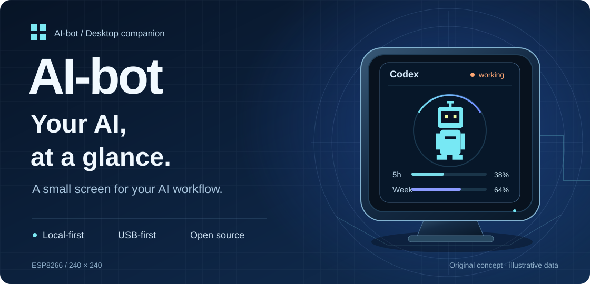
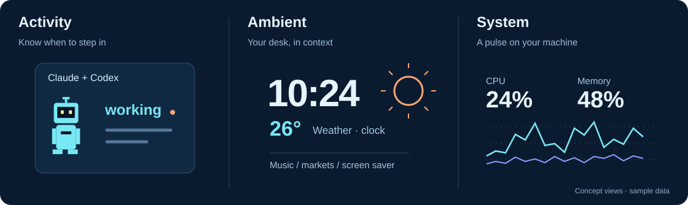
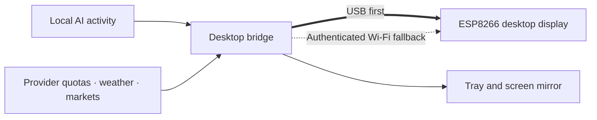

<p align="center">
  
</p>

<p align="center">
  <strong>A small screen for your AI workflow.</strong><br>
  Follow activity and account quotas, with weather, music and system information at your desk.
</p>

<p align="center">
  <a href="https://github.com/yaoyouzhong/AI-bot/actions/workflows/ci.yml"></a>
  <a href="LICENSE"></a>
  
  
</p>

<p align="center">
  <a href="README.md">简体中文</a> · <strong>English</strong><br>
  <a href="#a-live-window-on-your-desk">Features</a> ·
  <a href="#get-started">Get started</a> ·
  <a href="#current-status">Current status</a> ·
  <a href="#explore-the-project">Documentation</a>
</p>

---

## Stay with the work in front of you

Is your terminal still busy, or waiting for your next step? How much of this week's
quota have you used? AI-bot puts those signals on a small ESP8266 display.

The desktop bridge reads local Claude Code / Codex activity and provider quotas,
then sends them to the device. Windows connects over USB first and lives in the
system tray; a left click opens the screen mirror.

## A live window on your desk



<sub>Original concept illustrations with sample data. Actual UI and completion status are defined by the implementation and acceptance records.</sub>

| Keep track of work | Keep your desk informed |
| :--- | :--- |
| **AI activity**<br>Working, idle and offline states for Claude / Codex; attention signals and an explicit main-task completion chime. | **Weather and time**<br>Local conditions, an independent clock and automatic screen saving. Keep the last successful data during temporary outages. |
| **Quotas and balances**<br>Claude / Codex usage, resets and reset-credit details; Windows integrations for Alibaba, Kimi, MiniMax, DeepSeek and Zhipu. | **Music and markets**<br>Now-playing title, artwork and progress; paged watchlists for mainland China, Hong Kong and US markets. |
| **System monitoring**<br>CPU, memory and network activity, with live traffic graphs and a screen mirror. | **Animated companions**<br>The original BYTE SPROUT, plus local images/GIFs with license notices. Choose pets independently for Claude and Codex. |

**Choose what stays on screen.** Pin a page or cycle through quotas, weather, stocks
and more in your preferred order. Work events can wake the screen saver. When the
PC goes offline and the device still has power, it shows an independent `PC OFF` clock.

<details>
<summary><strong>What quota history can and cannot tell you</strong></summary>

Account quotas come from providers; local Token counts cover only visible local
logs. They are separate metrics. Windows retains 90 days of quota history. Daily
totals require verifiable Beijing-midnight, account and reset boundaries; incomplete
days show `--` and today is in progress. Two-minute polling can miss those boundaries,
so reliable accurate daily totals are not yet delivered. See [quota trends](docs/QUOTA_TRENDS.md).

</details>

## Local-first, starting with the connection



- **Direct USB:** automatic discovery and handshake at 460800 baud; basic USB operation does not require LAN reachability.
- **Bounded fallback:** attempts the paired LAN after USB goes stale. Network reachability is required; full fallback acceptance is still pending.
- **Useful data survives outages:** temporary provider failures preserve the last successful display state.

### Data moves only where it is needed

Session logs supply state, model, time and Token metadata; conversation text is not
uploaded. Account tokens are used only with matching provider endpoints, never in
display caches, serial data or logs. Domestic sign-in uses an isolated browser
profile. Private artwork, cookies, account caches and pairing data stay out of the
repository. See [data sources and privacy](docs/DATA_SOURCES.md) and [asset imports](docs/ASSET_POLICY.md).

## Get started

> **`0.1.0` is a development baseline, with no formal Release yet.** Build from source
> to try it and help validate it. Windows and firmware have passed builds and partial
> checks; this does not certify the complete product.

### Prepare the hardware

An ESP8266 / ESP-12S with a 240×240 ST7789 display using the SD2 pin layout, plus a
**USB data cable**. Check the driver and pin mapping before using another board.
See [firmware configuration](firmware/platformio.ini).

### Windows: build a local candidate

Install Git, Python and the .NET 8 SDK, then run:

```powershell
git clone https://github.com/yaoyouzhong/AI-bot.git
cd AI-bot
powershell -NoProfile -File scripts/package_windows_local.ps1
```

The script creates complete Windows and public-source ZIPs under `artifacts/`,
including notices and checksums, then tests the unpacked app. Add `-Firmware` to
also build firmware and its source-materials archive; PlatformIO 6.1.18 is required.

Extract the whole ZIP, install **.NET 8 Desktop Runtime x64** and **WebView2 Runtime**,
and launch `AIBotBridge.exe` from File Explorer. Do not copy the EXE alone. Exit the
bridge to release the serial port before flashing firmware.

[Windows installation and upgrades](docs/WINDOWS_PACKAGE.md) · [Firmware and rebuilding](docs/FIRMWARE_PACKAGE.md) · [Full development reference](docs/REFERENCE.en.md)

## Current status

| Platform / stage | Current evidence | Still to validate |
| :--- | :--- | :--- |
| **Windows** | Release build, isolated public regressions and CI pass | Fresh installation, live authorization, sustained operation and full interaction acceptance |
| **ESP8266** | Firmware build, source-material rebuild and CI pass; partial device checks | Every physical page, music and complete Wi-Fi fallback |
| **macOS** | Menu bar, mirror, serial and resource paths are implemented in source | Current CI build fails; platform fixes and real Mac acceptance are still required |
| **Distribution** | Public source and local materials prepared, with license and SHA-256 checks | Official release workflow integration and final-candidate acceptance |

Checked 2026-09-10: [corresponding CI run](https://github.com/yaoyouzhong/AI-bot/actions/runs/34450527452).
Follow [Actions](https://github.com/yaoyouzhong/AI-bot/actions) and [release readiness](docs/RELEASE_READINESS.md) for updates.

## Explore the project

| What you need | Start here |
| :--- | :--- |
| Features, commands and platform differences | [Feature and development reference](docs/REFERENCE.en.md) |
| Architecture, data and caching | [Development](docs/DEVELOPMENT.md) · [Data sources](docs/DATA_SOURCES.md) |
| Serial, resources and fallback | [Protocol](docs/PROTOCOL.md) · [USB validation](docs/USB_VALIDATION.md) |
| Completion status and known limits | [Parity matrix](docs/FUNCTIONAL_PARITY.md) · [Acceptance audit](docs/FULL_PARITY_AUDIT_2026-09-09.md) |
| Origins and distribution | [Provenance](PROVENANCE.md) · [Third-party notices](THIRD_PARTY_NOTICES.md) · [Distribution terms](docs/DISTRIBUTION_TERMS.md) |
| Recent changes | [Changelog](CHANGELOG.md) |

Feedback is welcome in [Issues](https://github.com/yaoyouzhong/AI-bot/issues).
Include your platform, version, device and reproduction steps, with account details,
tokens and private log contents removed.

---

<p align="center">
  <strong>AI-bot</strong><br>
  A window into the AI work on your desk.<br><br>
  <a href="LICENSE">Own source: MIT</a> · Original BYTE SPROUT · Local-first<br>
  <sub>Independent project. No affiliation with or endorsement by named AI providers. Third-party components retain their own licenses.</sub>
</p>
