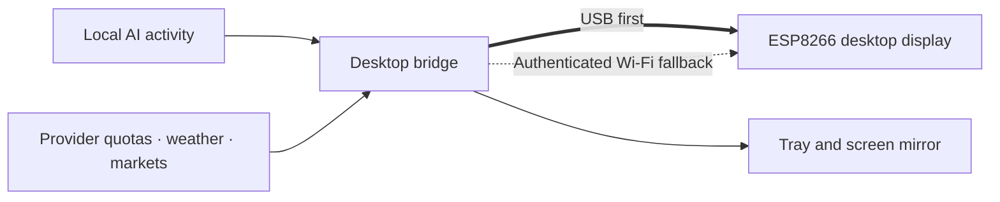

https://github.com/user-attachments/assets/dc69b524-0c0e-46cb-b92a-83d794968ccf


[▶ Download the 36-second product introduction (MP4, Chinese captions)](https://raw.githubusercontent.com/yaoyouzhong/AI-bot/main/docs/assets/product-intro/AI-bot-product-intro.mp4) · [Video provenance](docs/PRODUCT_VIDEO.md)

**v0.3.0 pre-release:** native Windows / Mac flashing windows with automatic USB identification, backup and firmware verification. Flashing pauses only USB; the bridge remains running. Devices on v0.2.2 firmware do not need reflashing. See the [changelog](CHANGELOG.md).

<p align="center">
  <strong>AI status at a glance.</strong><br>
  Task status and account quotas, together on a small desktop display.<br>
  <strong>Windows · macOS (Apple Silicon test build)</strong>
</p>

<p align="center">
  <a href="https://github.com/yaoyouzhong/AI-bot/actions/workflows/ci.yml"></a>
  <a href="LICENSE"></a>
  
  
</p>

<p align="center">
  <a href="README.md">简体中文</a> · <strong>English</strong><br>
  <a href="#a-live-window-on-your-desk">Features</a> ·
  <a href="#get-started">Get started</a> ·
  <a href="#current-status">Current status</a> ·
  <a href="#explore-the-project">Documentation</a>
</p>

---

## Stay with the work in front of you

Is your terminal still busy, or waiting for your next step? How much of this week's
quota have you used? AI-bot puts those signals on a small ESP8266 display.

The desktop bridge reads local Claude Code / Codex activity and provider quotas,
then sends them to the device. Windows connects over USB first and lives in the
system tray; a left click opens the screen mirror. Mac has a menu-bar test build with a mirror; real-Mac acceptance remains pending.

On Windows, Bridge service → Start at login uses a current-user scheduled task with a five-second delay, bypassing the ordinary startup queue. Repeated launches keep one bridge instance. Toggle an older startup registration off and on once to migrate it.

## A live window on your desk


<sub>Original concept illustrations with sample data. Actual UI and completion status are defined by the implementation and acceptance records.</sub>

| Keep track of work | Keep your desk informed |
| :--- | :--- |
| **AI activity**<br>Working, idle and offline states for Claude / Codex; attention signals and an explicit main-task completion chime. | **Weather and time**<br>Local conditions, an independent clock and automatic screen saving. Keep the last successful data during temporary outages. |
| **Quotas and balances**<br>Claude / Codex usage, resets and reset-credit details; Windows integrations for Alibaba, Kimi, MiniMax, DeepSeek and Zhipu; new MiMo, StepFun and Baidu adapters await live-account acceptance. | **Music and markets**<br>Now-playing title, artwork and progress; paged watchlists for mainland China, Hong Kong and US markets. |
| **System monitoring**<br>CPU, memory and network activity, with live traffic graphs and a screen mirror. | **Animated companions**<br>The original BYTE SPROUT, plus local images/GIFs with license notices. Choose pets independently for Claude and Codex. |

**Choose what stays on screen.** Pin a page or cycle through quotas, weather, stocks
and more in your preferred order. Work events can wake the screen saver. When the
PC goes offline and the device still has power, it shows an independent `PC OFF` clock.

<details>
<summary><strong>What quota history can and cannot tell you</strong></summary>

Account quotas come from providers; local Token counts cover only visible local
logs. They are separate metrics. Windows retains 90 days of quota history. Daily
figures sum verifiable observed increments by Beijing date. Partial days also show
recorded usage; today remains in progress and `--` means no comparable samples.
Only complete historical days enter averages. Gaps are not estimated, and an
unverified quota change does not prove the user performed a reset. See [quota trends](docs/QUOTA_TRENDS.md).

</details>

## Local-first, starting with the connection



- **Direct USB:** automatic discovery and handshake at 460800 baud; basic USB operation does not require LAN reachability.
- **Bounded fallback:** attempts the paired LAN after USB goes stale. Network reachability is required; full fallback acceptance is still pending.
- **Useful data survives outages:** temporary provider failures preserve the last successful display state.

### Data moves only where it is needed

Session logs supply state, model, time and Token metadata; conversation text is not
uploaded. Account tokens are used only with matching provider endpoints, never in
display caches, serial data or logs. Domestic sign-in uses an isolated browser
profile. Private artwork, cookies, account caches and pairing data stay out of the
repository. See [data sources and privacy](docs/DATA_SOURCES.md) and [asset imports](docs/ASSET_POLICY.md).

## Get started

**Download → install → connect USB → choose firmware → start flashing.** Follow the [complete illustrated installation guide (Chinese)](docs/INSTALL.zh.md) for every Windows/Mac step on one page, without terminal commands.

| Windows 10/11 | Mac (Apple Silicon) |
| --- | --- |
| [Download installer](https://github.com/yaoyouzhong/AI-bot/releases/download/v0.3.0/AIBotBridge-0.3.0-setup-win-x64.exe) | [Download Mac app](https://github.com/yaoyouzhong/AI-bot/releases/download/v0.3.0/AIBotBridge-0.3.0-local-candidate-macos-arm64.zip) |

[](docs/INSTALL.zh.md)

**Upgrading:** exit the bridge, install into the existing location and keep using your original shortcut. Do not launch copies from temporary extraction folders. Flashing tools are bundled; Windows setup downloads missing runtimes when needed.

BYTE SPROUT works out of the box; pet imports are optional. These are actual Windows mirror renders with fictional data. Codex and Claude screenshots show the maintainer’s currently selected pets with sample values; they are not photographs of a device.

<table>
<tr>
<td align="center"><br><strong>Codex quota</strong></td>
<td align="center"><br><strong>Claude quota</strong></td>
<td align="center"><br><strong>Dual quotas</strong></td>
</tr>
<tr>
<td align="center"><br><strong>Domestic model balance (DeepSeek)</strong></td>
<td align="center"><br><strong>Weather &amp; clock</strong></td>
<td align="center"><br><strong>System monitor</strong></td>
</tr>
<tr>
<td align="center"><br><strong>Music playback</strong></td>
<td align="center"><br><strong>Stocks</strong></td>
<td align="center"><br><strong>Lunar screensaver clock</strong></td>
</tr>
</table>

> **v0.3.0 pre-release: Windows installer includes the flashing tool.** Missing runtimes require internet access. Updated firmware is required for lunar dates and new model pages.
> The installer is unsigned; clean-machine install, upgrade and uninstall remain unverified. Mac is an Apple Silicon test build awaiting real-device acceptance.

The screensaver supports lunar dates with leap-month labels. This release also requires updated firmware for the manual page-selection fix.

**Setup:** right-click the tray → Model quotas → Domestic model quota settings. Full provider and plan labels are shown; API keys stay in Windows Credential Manager. See the [updated settings screenshot and guide](docs/DOMESTIC_QUOTA_SETUP.md). Unconfigured, never-authorized or unselected providers do not trigger automatic checks or failure reminders.

### Prepare the hardware

An ESP8266 / ESP-12S with a 240×240 ST7789 display using the SD2 pin layout, plus a
**USB data cable**. Check the driver and pin mapping before using another board.
See [firmware configuration](firmware/platformio.ini).

### Windows: build a local candidate

Install Git, Python and the .NET 8 SDK, then run:

```powershell
git clone https://github.com/yaoyouzhong/AI-bot.git
cd AI-bot
powershell -NoProfile -File scripts/package_windows_local.ps1
```

The script creates a Windows setup EXE, a complete Windows ZIP and a public-source ZIP under `artifacts/`,
including notices and checksums, then tests the unpacked app. Add `-Firmware` to
also build firmware and its source-materials archive; PlatformIO 6.1.18 is required.

For normal installation, follow the [complete illustrated guide (Chinese)](docs/INSTALL.zh.md); building from source is optional.

[Windows installation and upgrades](docs/INSTALL.zh.md) · [Firmware and rebuilding](docs/FIRMWARE_PACKAGE.md) · [Full development reference](docs/REFERENCE.en.md)

### macOS: Apple Silicon test build

Targets macOS 13+ on M-series chips. Follow the [Mac section of the complete guide](docs/INSTALL.zh.md#mac) for installation, firmware and connection.
The app is ad-hoc signed, without Developer ID signing or notarization. First launch, permissions and device behavior need real-Mac acceptance; Intel is unverified.

## Current status

| Platform / stage | Current evidence | Still to validate |
| :--- | :--- | :--- |
| **Windows** | Online setup, host detection, download integrity checks and isolated public regressions pass | Fresh installation, live authorization, sustained operation and full interaction acceptance |
| **ESP8266** | Firmware build, source-material rebuild and CI pass; partial device checks | Every physical page, music and complete Wi-Fi fallback |
| **macOS (Apple Silicon test build)** | Automated tests, Release compilation and app packaging run in the cloud; see Actions | First launch, permissions, devices and sustained operation; Developer ID signing and notarization; Intel unverified |
| **Distribution** | Setup EXE, Windows/Mac ZIPs, firmware materials and sources are packaged by tag with notices and SHA-256 | Fresh-logon startup, clean installation, real-Mac and complete device acceptance |

Candidate installation and acceptance: [Mac package](docs/INSTALL.zh.md) · [Release readiness](docs/RELEASE_READINESS.md) · [Candidate checklist](docs/CANDIDATE_ACCEPTANCE.md).

Documentation updated: 2026-09-21, **v0.3.0**.
Follow [Actions](https://github.com/yaoyouzhong/AI-bot/actions) and [release readiness](docs/RELEASE_READINESS.md) for updates.

## Explore the project

| What you need | Start here |
| :--- | :--- |
| Features, commands and platform differences | [Feature and development reference](docs/REFERENCE.en.md) |
| Architecture, data and caching | [Development](docs/DEVELOPMENT.md) · [Data sources](docs/DATA_SOURCES.md) |
| Serial, resources and fallback | [Protocol](docs/PROTOCOL.md) · [USB validation](docs/USB_VALIDATION.md) |
| Completion status and known limits | [Parity matrix](docs/FUNCTIONAL_PARITY.md) · [Acceptance audit](docs/FULL_PARITY_AUDIT_2026-09-09.md) |
| Origins and distribution | [Provenance](PROVENANCE.md) · [Third-party notices](THIRD_PARTY_NOTICES.md) · [Distribution terms](docs/DISTRIBUTION_TERMS.md) |
| Recent changes | [Changelog](CHANGELOG.md) |

Feedback is welcome in [Issues](https://github.com/yaoyouzhong/AI-bot/issues).
Include your platform, version, device and reproduction steps, with account details,
tokens and private log contents removed.

---

<p align="center">
  <strong>AI-bot</strong><br>
  A window into the AI work on your desk.<br><br>
  <a href="LICENSE">Own source: MIT</a> · Original BYTE SPROUT · Local-first<br>
  <sub>Independent project. No affiliation with or endorsement by named AI providers. Third-party components retain their own licenses.</sub>
</p>

## Installation

[Complete illustrated installation guide (Chinese)](docs/INSTALL.zh.md) — one page for downloads, Windows/Mac setup, device flashing, first connection, settings, upgrades and troubleshooting.
