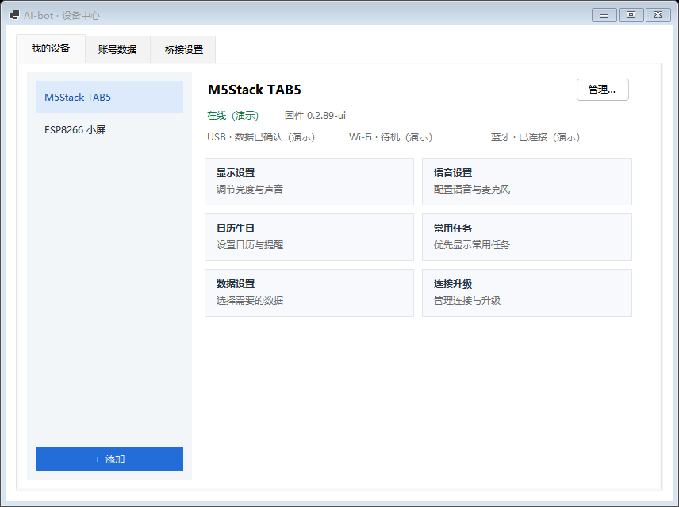
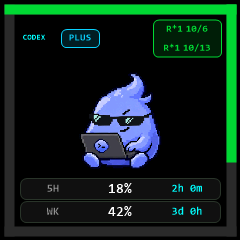
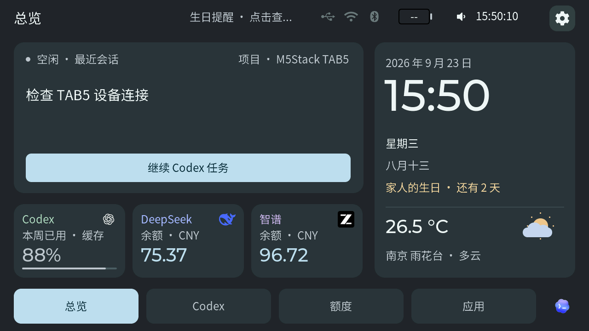
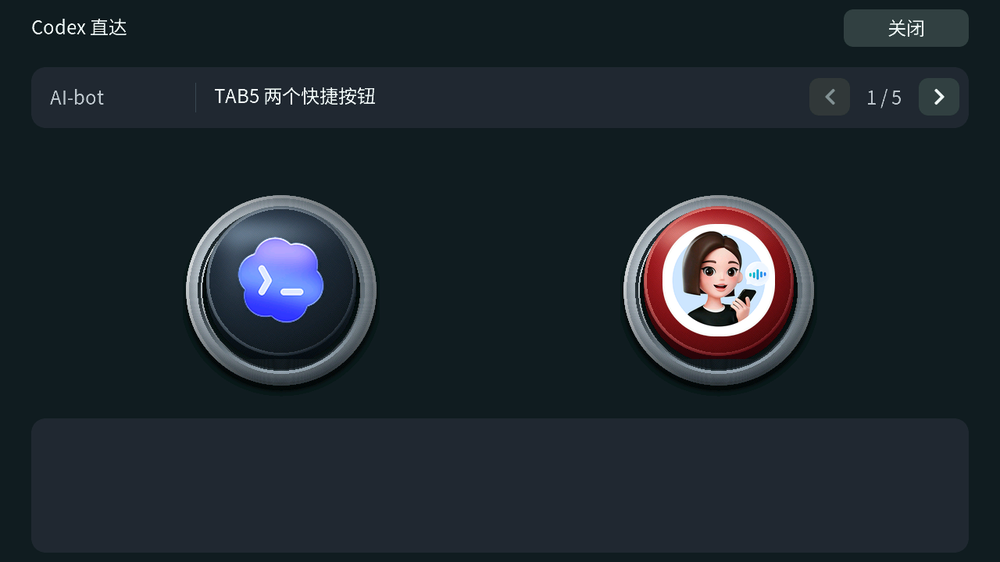
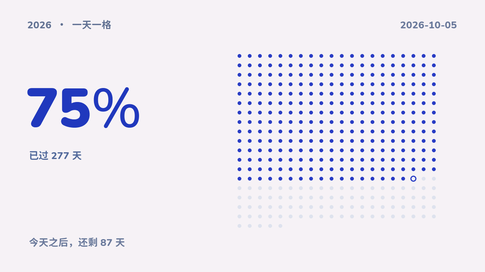
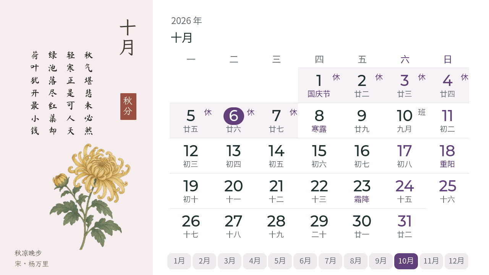

# AI-bot

**Your AI status, at a glance.** Bring Claude Code / Codex task status, account quotas and everyday information to an ESP8266 desktop display or M5Stack TAB5.

[Complete download center](DOWNLOADS.en.md) · [Downloads and device pairing](#downloads-and-device-pairing) · [Installation guide](docs/INSTALL.zh.md) · [Release highlights and details](docs/RELEASE-0.6.2.md) · [简体中文](README.md)

https://github.com/user-attachments/assets/46e3c026-e084-46e2-a1e2-e069fdab49f1

108-second product tour with Chinese captions; click to play here. Native interfaces use fixed demo data. [Download MP4](https://github.com/yaoyouzhong/AI-bot/raw/refs/heads/main/docs/assets/product-intro/AI-bot-product-intro.mp4) · [Media and artwork credits](docs/PRODUCT_VIDEO.md)

## What it does

<table>
<thead><tr><th width="160" nowrap="nowrap">Feature</th><th nowrap="nowrap">Details</th></tr></thead>
<tbody>
<tr><td nowrap="nowrap"><strong>Task status</strong></td><td nowrap="nowrap">Claude / Codex working, idle and waiting states; completion alerts.</td></tr>
<tr><td nowrap="nowrap"><strong>Account quotas</strong></td><td nowrap="nowrap">Usage, API balances, resets and Codex credits; history on the computer.</td></tr>
<tr><td nowrap="nowrap"><strong>Daily information</strong></td><td nowrap="nowrap">Weather, clocks, stocks, computer load and current music.</td></tr>
<tr><td nowrap="nowrap"><strong>Display settings</strong></td><td nowrap="nowrap">Fixed page, cycle or smart switching; choose pages, order, interval and pets.</td></tr>
<tr><td nowrap="nowrap"><strong>Device management</strong></td><td nowrap="nowrap">Windows Device Center: accounts, data, devices; check, download and verify updates. <a href="docs/UPDATES.md">Guide</a></td></tr>
</tbody>
</table>

<table>
<thead><tr><th width="33%" nowrap="nowrap">Computer app</th><th width="33%" nowrap="nowrap">ESP8266 display</th><th width="33%" nowrap="nowrap">TAB5 touch display</th></tr></thead>
<tbody>
<tr>
<td align="center" valign="middle"></td>
<td align="center" valign="middle"></td>
<td align="center" valign="middle"></td>
</tr>
<tr><td align="center" nowrap="nowrap">Accounts, devices and updates</td><td align="center" nowrap="nowrap">Status, quotas and daily info</td><td align="center" nowrap="nowrap">Touch controls and overview</td></tr>
</tbody>
</table>

Current native interfaces with fixed demo data; the small display uses its computer mirror renderer. [Complete feature gallery](docs/FEATURES.zh.md)

### Two devices, different strengths

<table>
<thead><tr><th width="170" nowrap="nowrap">Device</th><th width="120" nowrap="nowrap">Operation</th><th nowrap="nowrap">Main features</th></tr></thead>
<tbody>
<tr><td nowrap="nowrap"><strong>ESP8266 display</strong></td><td nowrap="nowrap">PC setup</td><td nowrap="nowrap">AI status, quotas, page cycling, pets and clock. <a href="docs/FEATURES.zh.md#esp8266">Gallery</a></td></tr>
<tr><td nowrap="nowrap"><strong>TAB5 touch display</strong></td><td nowrap="nowrap">Touch</td><td nowrap="nowrap">Codex Direct, voice/photo drafts, calendar and eight screensavers. <a href="docs/FEATURES.zh.md#tab5">Gallery</a></td></tr>
</tbody>
</table>

<strong>Explore TAB5 highlights: Codex Direct, Annual Dots and the floral calendar</strong>

**Codex Direct:** pick one of five recent sessions, read replies, dictate a draft and confirm before sending. Cancel, recover from failures or hold to clear. [Guide](docs/TAB5-QUICK-CONSOLE.md)

<table><tr>
<td align="center" width="33%"><strong>Codex Direct</strong>  </td>
<td align="center" width="33%"><strong>Annual Dots</strong>  </td>
<td align="center" width="33%"><strong>Floral calendar</strong>  </td>
</tr></table>

Annual Dots gives every day a dot, with leap-year support, three palettes and automatic day/night switching. The floral calendar includes lunar dates, solar terms and holidays. Neither needs an extra collection. Paintings and calligraphy support landscape and portrait and retain the work title, artist and museum; verified Chinese titles appear on screen, with original collection titles retained otherwise.

[Portrait painting](docs/assets/screens/tab5-painting-portrait.png) · [Portrait calligraphy](docs/assets/screens/tab5-calligraphy-portrait.png) · [Complete screensaver guide](docs/FEATURES.zh.md#tab5)

## Downloads and device pairing

<!-- downloads:start -->
| Use | Version | Download | SHA-256 |
| --- | --- | --- | --- |
| Windows bridge · Windows 10/11 x64 | 0.6.1 | [Download · 56 MiB](https://github.com/yaoyouzhong/AI-bot/releases/download/bridge-v0.6.1/AIBotBridge-0.6.1-setup-win-x64.exe) | [SHA-256](https://github.com/yaoyouzhong/AI-bot/releases/download/bridge-v0.6.1/SHA256SUMS.txt) |
| Mac bridge · macOS 13+ / Apple Silicon | 0.6.1 | [Download · 46 MiB](https://github.com/yaoyouzhong/AI-bot/releases/download/bridge-v0.6.1/AIBotBridge-0.6.1-local-candidate-macos-arm64.zip) | [SHA-256](https://github.com/yaoyouzhong/AI-bot/releases/download/bridge-v0.6.1/SHA256SUMS.txt) |
| ESP8266 display · first install / upgrade | 0.5.0 | [Download · 30 MiB](https://github.com/yaoyouzhong/AI-bot/releases/download/v0.5.0/AI-bot-0.5.0-firmware-materials.zip) | [SHA-256](https://github.com/yaoyouzhong/AI-bot/releases/download/v0.5.0/SHA256SUMS.txt) |
| TAB5 · first install from factory system | 0.2.149-ui | [Download · 4 MiB](https://github.com/yaoyouzhong/AI-bot/releases/download/tab5-v0.2.149-ui/TAB5-first-install-0.2.149-ui.zip) | [SHA-256](https://github.com/yaoyouzhong/AI-bot/releases/download/tab5-v0.2.149-ui/SHA256SUMS.txt) |
| TAB5 · upgrade existing AI-bot | 0.2.149-ui | [Download · 4 MiB](https://github.com/yaoyouzhong/AI-bot/releases/download/tab5-v0.2.149-ui/TAB5-upgrade-0.2.149-ui.zip) | [SHA-256](https://github.com/yaoyouzhong/AI-bot/releases/download/tab5-v0.2.149-ui/SHA256SUMS.txt) |
| Daily Calligraphy · optional collection | 2026.10.07 | [Download · 726 MiB](https://github.com/yaoyouzhong/AI-bot/releases/download/tab5-v0.2.145-ui/AI-bot-DailyCalligraphy-2026.10.07.zip) | [SHA-256](https://github.com/yaoyouzhong/AI-bot/releases/download/tab5-v0.2.145-ui/SHA256SUMS.txt) |
| Daily Painting · optional collection | 2026.10.07 | [Download · 199 MiB](https://github.com/yaoyouzhong/AI-bot/releases/download/tab5-v0.2.145-ui/AI-bot-DailyPainting-2026.10.07.zip) | [SHA-256](https://github.com/yaoyouzhong/AI-bot/releases/download/tab5-v0.2.145-ui/SHA256SUMS.txt) |

Install the computer bridge, then choose firmware for your device. Artwork collections are optional. Components update independently; reinstalling an unchanged version is unnecessary.

- **Factory TAB5**: choose the first-install ZIP. **Existing AI-bot**: extract the upgrade ZIP and select `aibot_tab5.bin`, keeping its release-notes file beside it. Firmware is not interchangeable between devices.
- **Collections**: import ZIPs directly through Windows Software and Firmware Updates → Artwork Collections. App upgrades preserve collections. Requires Windows bridge 0.6.0+ and TAB5 0.2.145-ui+.
- Windows supports ESP8266 and TAB5. Mac currently supports ESP8266; TAB5, unified updates and artwork import instructions apply to Windows. Windows setup is unsigned; Mac is ad-hoc signed and not notarized.

[Installation guide](https://github.com/yaoyouzhong/AI-bot/blob/main/docs/INSTALL.zh.md) · [Collection sizes and licenses](https://github.com/yaoyouzhong/AI-bot/blob/main/docs/GALLERY-PACKS.md) · [Earlier releases](https://github.com/yaoyouzhong/AI-bot/releases)
<!-- downloads:end -->

## Setup and future updates

1. **Install and open the computer app.** On Windows, right-click the tray icon and open Device Center. Existing users should exit the bridge and install to the original location.
2. **Add your device.** Use a USB data cable and follow the [illustrated guide](docs/INSTALL.zh.md) for initial flashing, registration and pairing. Devices already running AI-bot can be verified and added directly.
3. **Choose what to display.** Configure accounts, everyday information and cycling pages. Import a collection before using its TAB5 art screensaver; keep the computer and bridge running during image synchronization.

For later updates, open Windows Device Center → Bridge Settings → Software/Firmware to reach **Software and Firmware Updates** to read each component's notes, download and verify its package, then follow the installation prompts. Enable automatic checks for new-version notifications; installation still requires your confirmation. Download and import artwork collections separately as needed. [Full update steps](docs/UPDATES.md)

## Further reading

- **Use and updates:** [Feature gallery](docs/FEATURES.zh.md) · [Changes by component](docs/RELEASE-0.6.2.md) · [Changelog](CHANGELOG.md) · [TAB5 hardware acceptance](docs/TAB5-BLE-GALLERY-148.md)
- **Data and privacy:** [Data sources](docs/DATA_SOURCES.md) · [Quota-history boundaries](docs/QUOTA_TRENDS.md). Activity statistics extract local status and token metadata; account quotas come from provider interfaces and are counted separately.
- **Development and source:** [Development guide](docs/DEVELOPMENT.md) · [Protocol](docs/PROTOCOL.md) · [TAB5 source and builds](docs/development/TAB5-SOURCE.md) · [Independent component versions](docs/COMPONENT-VERSIONS.md)
- **Materials and licenses:** [Provenance](PROVENANCE.md) · [Third-party notices](THIRD_PARTY_NOTICES.md) · [Screenshots and art credits](docs/SCREENSHOTS.md) · [Optional pet animation pack](docs/assets/pet/README.md)

Own code, including TAB5, is [MIT licensed](LICENSE). Third-party components and artworks retain their original licenses. This independent project has no affiliation with the named AI providers. [Report issues](https://github.com/yaoyouzhong/AI-bot/issues) with your platform, versions, hardware and reproduction steps; remove credentials and private logs.
