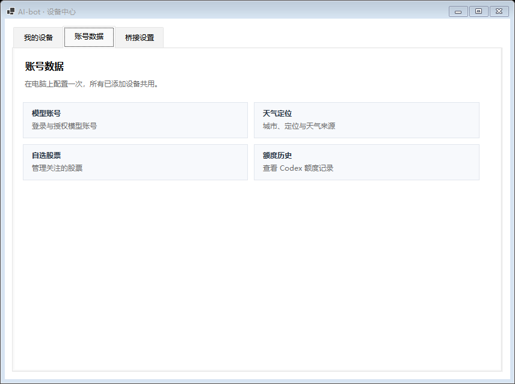

# AI-bot

**Your AI status, at a glance.** Bring Claude Code / Codex task status, account quotas and everyday information to an ESP8266 desktop display or M5Stack TAB5.

[Downloads and device pairing](#downloads-and-device-pairing) · [Installation guide](docs/INSTALL.zh.md) · [Release highlights and details](docs/RELEASE-0.6.0.md) · [简体中文](README.md)

https://github.com/user-attachments/assets/ea8a8241-625f-4afe-8d24-1e4dc3c043db

108-second product tour with Chinese captions; click to play here. Native interfaces use fixed demo data. [Download MP4](https://github.com/yaoyouzhong/AI-bot/raw/refs/heads/main/docs/assets/product-intro/AI-bot-product-intro.mp4) · [Media and artwork credits](docs/PRODUCT_VIDEO.md)

## What it does

| When you use it | What you get |
| --- | --- |
| **Follow work at a glance** | Claude / Codex activity, waiting-for-input and completion alerts keep task status visible. |
| **Understand account quotas** | Account usage, API balances, reset times and Codex reset credits; quota history on the computer. |
| **Keep everyday information nearby** | Weather, clocks, stocks, computer load and current music. |
| **Choose how to display it** | A fixed page, a page cycle or activity-driven switching; choose pages, order, interval and pet animations. |
| **Manage it from the computer** | Windows Device Center configures accounts and data sources and manages both device types. Software and Firmware Updates shows notes, then downloads and verifies the matching package. [Update guide](docs/UPDATES.md) |

<table><tr>
<td align="center" width="33%"><strong>Computer: setup and management</strong>    Configure data, manage devices and updates</td>
<td align="center" width="33%"><strong>ESP8266: status and quotas</strong>    Glance at status and cycle everyday information</td>
<td align="center" width="33%"><strong>TAB5: tasks and information</strong>    See the overview and tap into each page</td>
</tr></table>

Current native interfaces with fixed demo data; the small display uses its computer mirror renderer. [Complete feature gallery](docs/FEATURES.zh.md)

### Two devices, different strengths

| Device | How you use it | Device features |
| --- | --- | --- |
| **ESP8266 small display** | Display-focused, configured on the computer | AI status and quotas, everyday page cycling, pets and a clock screensaver. [Complete small-display tour](docs/FEATURES.zh.md#esp8266) |
| **TAB5 touch display** | Display and touch interaction | Task reading, Codex Direct, voice/camera drafts, calendar and eight screensavers; paintings/calligraphy support landscape and portrait. [Complete TAB5 tour](docs/FEATURES.zh.md#tab5) |

<strong>Explore TAB5 highlights: Codex Direct, Annual Dots and the floral calendar</strong>

**Codex Direct:** pick one of five recent sessions, read replies, dictate a draft and confirm before sending. Cancel, recover from failures or hold to clear. [Guide](docs/TAB5-QUICK-CONSOLE.md)

<table><tr>
<td align="center" width="33%"><strong>Codex Direct</strong>  </td>
<td align="center" width="33%"><strong>Annual Dots</strong>  </td>
<td align="center" width="33%"><strong>Floral calendar</strong>  </td>
</tr></table>

Annual Dots gives every day a dot, with leap-year support, three palettes and automatic day/night switching. The floral calendar includes lunar dates, solar terms and holidays. Neither needs an extra collection. Paintings and calligraphy retain the work title, artist and museum; verified Chinese titles appear on screen, with original collection titles retained otherwise.

[Portrait painting](docs/assets/screens/tab5-painting-portrait.png) · [Portrait calligraphy](docs/assets/screens/tab5-calligraphy-portrait.png) · [Complete screensaver guide](docs/FEATURES.zh.md#tab5)

## Downloads and device pairing

**One computer app + the firmware for your device.** Choose either display, or connect one of each. The three components have independent version numbers and do not need to be updated together.

### 1. Install the computer app · 0.6.0

| Your computer | Download | Supported devices |
| --- | --- | --- |
| Windows 10/11 x64 | [Windows installer](https://github.com/yaoyouzhong/AI-bot/releases/download/bridge-v0.6.0/AIBotBridge-0.6.0-setup-win-x64.exe) | ESP8266 and TAB5 |
| macOS 13+ · Apple Silicon | [Mac application ZIP](https://github.com/yaoyouzhong/AI-bot/releases/download/bridge-v0.6.0/AIBotBridge-0.6.0-local-candidate-macos-arm64.zip) | ESP8266; menu-bar app and screen mirror |

The TAB5, unified-update and artwork-import instructions describe Windows features. Windows setup is unsigned. The Mac app is ad-hoc signed and not notarized; Intel Macs are unverified.

### 2. Choose firmware for your display

| Your device | Firmware | Which package to use |
| --- | --- | --- |
| **ESP8266 small display** · 240×240 ST7789 | 0.5.0 | [Installation / upgrade package](https://github.com/yaoyouzhong/AI-bot/releases/download/v0.5.0/AI-bot-0.5.0-firmware-materials.zip); no reflash needed if already on this version. |
| **M5Stack TAB5** · touch display | 0.2.145-ui | Factory devices: [first-install ZIP](https://github.com/yaoyouzhong/AI-bot/releases/download/tab5-v0.2.145-ui/TAB5-first-install-0.2.145-ui.zip). Existing AI-bot devices: [upgrade ZIP](https://github.com/yaoyouzhong/AI-bot/releases/download/tab5-v0.2.145-ui/TAB5-upgrade-0.2.145-ui.zip). |

Select the TAB5 first-install ZIP directly. For an upgrade, extract the ZIP and select `aibot_tab5.bin`, keeping the release-notes file beside it. Firmware for the two devices is not interchangeable. See the [illustrated installation guide](docs/INSTALL.zh.md) for wiring, backup and flashing.

<strong>Optional: painting and calligraphy collections for TAB5</strong>

| Collection | Distinct works | Download |
| --- | ---: | --- |
| Daily Painting | 402 | [Painting ZIP · 199 MiB](https://github.com/yaoyouzhong/AI-bot/releases/download/tab5-v0.2.145-ui/AI-bot-DailyPainting-2026.10.07.zip) |
| Daily Calligraphy | 411 | [Calligraphy ZIP · 726 MiB](https://github.com/yaoyouzhong/AI-bot/releases/download/tab5-v0.2.145-ui/AI-bot-DailyCalligraphy-2026.10.07.zip) |

Import the ZIP through Windows Software and Firmware Updates → Artwork Collections without extracting it. App upgrades preserve collections; other features work without them. Calligraphy includes multi-page albums and scrolls, making its package larger. Pages do not count as extra works. [Installation, sizes and licenses](docs/GALLERY-PACKS.md)

Checksums and earlier releases

SHA-256: [computer apps](https://github.com/yaoyouzhong/AI-bot/releases/download/bridge-v0.6.0/SHA256SUMS.txt) · [TAB5 and art collections](https://github.com/yaoyouzhong/AI-bot/releases/download/tab5-v0.2.145-ui/SHA256SUMS.txt) · [ESP8266](https://github.com/yaoyouzhong/AI-bot/releases/download/v0.5.0/SHA256SUMS.txt). [Earlier releases](https://github.com/yaoyouzhong/AI-bot/releases)

## Setup and future updates

1. **Install and open the computer app.** On Windows, right-click the tray icon and open Device Center. Existing users should exit the bridge and install to the original location.
2. **Add your device.** Use a USB data cable and follow the [illustrated guide](docs/INSTALL.zh.md) for initial flashing, registration and pairing. Devices already running AI-bot can be verified and added directly.
3. **Choose what to display.** Configure accounts, everyday information and cycling pages. Import a collection before using its TAB5 art screensaver; keep the computer and bridge running during image synchronization.

For later updates, open Windows Device Center → Bridge Settings → Software/Firmware to reach **Software and Firmware Updates** to read each component's notes, download and verify its package, then follow the installation prompts. Enable automatic checks for new-version notifications; installation still requires your confirmation. Download and import artwork collections separately as needed. [Full update steps](docs/UPDATES.md)

## Further reading

- **Use and updates:** [Feature gallery](docs/FEATURES.zh.md) · [Changes by component](docs/RELEASE-0.6.0.md) · [Changelog](CHANGELOG.md) · [TAB5 hardware acceptance](docs/TAB5-ACCEPTANCE-145.md)
- **Data and privacy:** [Data sources](docs/DATA_SOURCES.md) · [Quota-history boundaries](docs/QUOTA_TRENDS.md). Activity statistics extract local status and token metadata; account quotas come from provider interfaces and are counted separately.
- **Development and source:** [Development guide](docs/DEVELOPMENT.md) · [Protocol](docs/PROTOCOL.md) · [TAB5 source and builds](docs/development/TAB5-SOURCE.md) · [Independent component versions](docs/COMPONENT-VERSIONS.md)
- **Materials and licenses:** [Provenance](PROVENANCE.md) · [Third-party notices](THIRD_PARTY_NOTICES.md) · [Screenshots and art credits](docs/SCREENSHOTS.md) · [Optional pet animation pack](docs/assets/pet/README.md)

Own code, including TAB5, is [MIT licensed](LICENSE). Third-party components and artworks retain their original licenses. This independent project has no affiliation with the named AI providers. [Report issues](https://github.com/yaoyouzhong/AI-bot/issues) with your platform, versions, hardware and reproduction steps; remove credentials and private logs.
