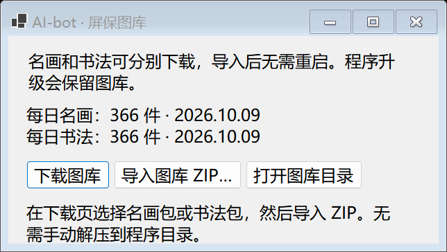

# AI-bot

This update: **AI-bot 0.6.0 + TAB5 0.2.145-ui**; ESP8266 remains 0.5.0. Highlights include Codex Direct, unified updates, a floral calendar and eight screensavers. Painting/calligraphy features are public, with two optional downloadable collection ZIPs and the same local/public functionality. See [complete notes and acceptance status](docs/RELEASE-0.6.0.md) and [collection installation](docs/GALLERY-PACKS.md). Firmware hardware acceptance has passed.

**AI status at a glance.** A desktop AI status assistant that brings Claude Code / Codex activity, account quotas and everyday information to an **ESP8266 display or M5Stack TAB5**.

[**Download AI-bot 0.6.0**](https://github.com/yaoyouzhong/AI-bot/releases/tag/bridge-v0.6.0) · [TAB5 firmware and optional art](https://github.com/yaoyouzhong/AI-bot/releases/tag/tab5-v0.2.145-ui) · [Installation guide](docs/INSTALL.zh.md#english-summary) · [简体中文](README.md)

Computer app **0.6.0**, ESP8266 **0.5.0**, TAB5 **0.2.145-ui**. Install the app, then choose firmware for your device; ESP8266 0.5.0 needs no reflash. See [three-component release notes](docs/RELEASE-0.6.0.md).

The bridge and both firmwares update independently. Their numbers need not match; follow each component's notes rather than reflashing every device for every update. See [independent versions](docs/COMPONENT-VERSIONS.md).

The Windows 0.6.0 adds one Software and Firmware Updates entry: receive component-specific notifications, select a device, download and verify its matching package, then open the installation tool. Existing TAB5 installations get upgrade packages; first-time setup remains in the device center. See [updating instructions](docs/UPDATES.md).

A release highlight is [TAB5 Codex Direct](docs/TAB5-QUICK-CONSOLE.md): a permanent bottom-right entry, five recent conversations and previous/next selection, voice drafts in the selected conversation, explicit sending, cancellation, failure recovery and long-press clearing.

 · 126-second product overview

[Download updated video (126 seconds, Chinese captions)](https://github.com/yaoyouzhong/AI-bot/raw/refs/heads/main/docs/assets/product-intro/AI-bot-product-intro.mp4) · [Media provenance](docs/PRODUCT_VIDEO.md)

[Download pet animation ZIP](docs/assets/pet/AI-bot-pet.zip) · [Preview GIF](docs/assets/pet/AI-bot-mascot.gif) · [Import instructions](docs/assets/pet/README.md)

The film uses native interfaces and synthetic data to show Codex Direct, unified updates, the floral calendar and landscape/portrait art. The optional mascot is a design preview, not a change to the default character.

## Highlights in this release

### Codex Direct: choose a conversation, dictate, then send

A persistent bottom-right TAB5 entry opens the five recent conversations. Switch the target, dictate into its draft, review and explicitly send. Cancellation, failure recovery and long-press clearing are supported. [Usage guide](docs/TAB5-QUICK-CONSOLE.md)

### One place to find the right update

Open Software and Firmware Updates on Windows to view computer-app, ESP8266 and TAB5 versions and notes. Select your device to download and verify the matching package. Components have independent versions and need not update together. [Updating instructions](docs/UPDATES.md)

### A year in dots: one day per dot

Annual Dots places all 365/366 days on one screen, distinguishing past days, today and remaining days alongside progress and day counts. Choose default, night or warm-gray colors, or automatic day/night colors: daytime is 07:00–19:00 in device-local time. No art download is required.

Color previews: [night](docs/assets/screens/tab5-annual-night.png) · [warm gray](docs/assets/screens/tab5-annual-warm.png). The film gives Annual Dots its own segment at 94–100 seconds.

### A floral calendar and art that follows your orientation

The monthly calendar pairs seasonal flowers with lunar dates, solar terms and holidays. Artwork supports upright/inverted landscape and both portrait directions in preview and automatic screensavers, including subsequent calligraphy pages. Captions preserve titles, artists and museums. Verified Chinese equivalents are displayed; otherwise original collection titles remain.

<table><tr>
<td align="center" width="50%"><strong>Daily Painting · Portrait</strong>  </td>
<td align="center" width="50%"><strong>Daily Calligraphy · Portrait</strong>  </td>
</tr></table>

Landscape views: [painting](docs/assets/screens/tab5-painting.png) · [calligraphy](docs/assets/screens/tab5-calligraphy.png). These are native rendered interfaces, not hardware photographs. [Sources, licenses and capture method](docs/SCREENSHOTS.md).

Download either art collection separately; neither is embedded in firmware. Other screensavers work without them. Import the ZIP under Software and Firmware Updates → Artwork Collections without extracting it. App upgrades preserve installed art.

| Optional collection | Distinct works | Content pages | Landscape/portrait images | ZIP size |
| --- | ---: | ---: | ---: | ---: |
| [Daily Painting](https://github.com/yaoyouzhong/AI-bot/releases/download/tab5-v0.2.145-ui/AI-bot-DailyPainting-2026.10.07.zip) | 402 | 402 | 804 | 199 MiB |
| [Daily Calligraphy](https://github.com/yaoyouzhong/AI-bot/releases/download/tab5-v0.2.145-ui/AI-bot-DailyCalligraphy-2026.10.07.zip) | 411 | 1,500 | 3,000 | 726 MiB |

Calligraphy includes more albums and scrolls with multiple pages. Each page has both layouts, making its ZIP about 3.6 times larger despite similar per-image sizes. Pages and layouts never count as extra works. [Installation and licensing](docs/GALLERY-PACKS.md)

## A live window on your desk

The bridge reads local AI activity and provider quotas and sends them to your device. Windows lives in the system tray; macOS provides a menu-bar app and screen mirror. Device features differ by platform.

| Feature | What it shows |
| --- | --- |
| AI activity | Claude / Codex working, idle, offline and waiting for input; task-completion reminders |
| Quotas and balances | Account usage, reset times, supported provider balances and recorded quota trends |
| Everyday information | Weather, clock, stocks, system monitoring and now-playing music |
| Companions and display | Original BYTE SPROUT pet, brightness, selected pages and automatic cycling |
| TAB5 interaction | Touch interface, activity/history, voice input, calendar/birthdays and frequent tasks |

<table>
<tr>
<td align="center" width="33%"><strong>AI quotas and pet</strong>   Quotas, reset times and animation</td>
<td align="center" width="33%"><strong>Weather and clock</strong>   City, temperature and humidity</td>
<td align="center" width="33%"><strong>Market quotes</strong>   Watchlist, prices and changes</td>
</tr>
<tr>
<td align="center" width="33%"><strong>System monitor</strong>   CPU, memory and network rates</td>
<td align="center" width="33%"><strong>Music playback</strong>   Track and playback progress</td>
<td align="center" width="33%"><strong>Lunar screensaver</strong>   Time, weekday and lunar date</td>
</tr>
</table>

Native Windows mirror layouts with synthetic data. The selected mascot is a design preview; application and firmware defaults are unchanged. These are not hardware photographs.

### Two devices, one Windows Device Center

**My Devices / Accounts and Data / Bridge Settings** separates device settings from shared accounts. You can register one ESP8266 and one TAB5 together, manage their connections independently and share data sources.

- **ESP8266:** 240×240 ST7789 display using the SD2 pin configuration; USB-first automatic mode with paired Wi-Fi fallback, or a selected USB/Wi-Fi mode.
- **TAB5:** touch display and USB / Wi-Fi / BLE connections. Automatic mode prefers USB, then Wi-Fi, then BLE; factory installation uses USB.
  Firmware upgrades support Wi-Fi / USB / BLE and negotiated compression. Automatic upgrades prefer Wi-Fi, then USB, then BLE; fixed modes retain their transport. See [updating instructions](docs/UPDATES.md) and the [TAB5 changelog](docs/development/TAB5-CHANGELOG.md).
- Tray left-click opens the enabled ESP8266 preview, or Device Center otherwise; right-click provides device settings. Start at login is under **Device Center → Bridge Settings**.

More interface examples

<table>
<tr>
<td align="center"> <strong>Codex quota</strong></td>
<td align="center"> <strong>Claude quota</strong></td>
<td align="center"> <strong>Dual quotas</strong></td>
</tr>
<tr>
<td align="center"> <strong>Domestic model balance (DeepSeek)</strong></td>
<td align="center"> <strong>Weather &amp; clock</strong></td>
<td align="center"> <strong>System monitor</strong></td>
</tr>
<tr>
<td align="center"> <strong>Music playback</strong></td>
<td align="center"> <strong>Stocks</strong></td>
<td align="center"> <strong>Lunar screensaver clock</strong></td>
</tr>
</table>

### Local data and clear quota boundaries

Activity collection extracts status, model, timestamps and token metadata from local logs. It does not upload conversation text. Account quotas come from provider interfaces; local token totals cover only visible local logs and are kept separate. Failed requests retain the last successful display data.

Windows quota history retains up to 90 days of observed samples. Missing periods are not estimated; ambiguous changes remain uncertain. Provider availability depends on a valid supported account and authorization. See [quota trends](docs/QUOTA_TRENDS.md), [data sources](docs/DATA_SOURCES.md) and [asset policy](docs/ASSET_POLICY.md).

## Get started

**Install the app → choose your hardware → select factory installation or upgrade → back up, flash and verify → register and pair.** See the [illustrated guide](docs/INSTALL.zh.md).

| Download | Platform or purpose |
| --- | --- |
| [Windows installer](https://github.com/yaoyouzhong/AI-bot/releases/download/bridge-v0.6.0/AIBotBridge-0.6.0-setup-win-x64.exe) | Windows 10/11 x64; flashing tools included |
| [Mac application](https://github.com/yaoyouzhong/AI-bot/releases/download/bridge-v0.6.0/AIBotBridge-0.6.0-local-candidate-macos-arm64.zip) | macOS 13+, Apple Silicon |
| [ESP8266 firmware](https://github.com/yaoyouzhong/AI-bot/releases/download/v0.5.0/AI-bot-0.5.0-firmware-materials.zip) | Firmware and corresponding source/build materials |
| [TAB5 factory-install ZIP](https://github.com/yaoyouzhong/AI-bot/releases/download/tab5-v0.2.145-ui/TAB5-first-install-0.2.145-ui.zip) | Factory devices: full installation image |
| [TAB5 upgrade ZIP](https://github.com/yaoyouzhong/AI-bot/releases/download/tab5-v0.2.145-ui/TAB5-upgrade-0.2.145-ui.zip) | Existing AI-bot devices: extract and select `aibot_tab5.bin` |

Checksums: [computer apps](https://github.com/yaoyouzhong/AI-bot/releases/download/bridge-v0.6.0/SHA256SUMS.txt) · [TAB5 and art collections](https://github.com/yaoyouzhong/AI-bot/releases/download/tab5-v0.2.145-ui/SHA256SUMS.txt) · [ESP8266](https://github.com/yaoyouzhong/AI-bot/releases/download/v0.5.0/SHA256SUMS.txt). Packages contain licenses and notices. Older versions remain under [Releases](https://github.com/yaoyouzhong/AI-bot/releases).

**TAB5 first installation also uses 0.2.145-ui.** Select the complete first-install ZIP, which includes bootloader, partitions and application. An application BIN alone cannot initialize a factory device. Keep the notes sidecar alongside the upgrade BIN.

Use a USB data cable. ESP8266 requires the matching ST7789/SD2 wiring; TAB5 uses its USB-C data connector. Finish by verifying the actual screen and connections and preserving automatic cycling, pages, order and interval.

Existing Windows users should exit the bridge, install to the original location and use their existing shortcut. Windows setup is unsigned. The Mac application is ad-hoc signed and not notarized; Intel Macs are unverified. Mac's flashing window currently supports ESP8266; the TAB5 factory-install, pairing and upgrade flows described here are Windows features.

## Current status

| Component | Current release scope |
| --- | --- |
| Windows 0.6.0 | Unified updates, optional art imports, Codex Direct bridge and dual-device management |
| ESP8266 0.5.0 | Display pages, clock, pet, USB / Wi-Fi and automatic cycling |
| TAB5 0.2.145-ui | Codex Direct, eight screensavers, four art orientations, compressed fonts and image/page fixes |
| macOS 0.6.0 | Apple Silicon menu-bar bridge, mirror and ESP8266 flashing |

On 2026-10-07, TAB5 `.145` passed user checks for images and portrait switching on second and subsequent pages. Earlier normal-interface, typing, preview and automatic-orientation checks are recorded in [hardware acceptance](docs/TAB5-ACCEPTANCE-145.md). Windows regressions, macOS tests/build and ESP8266 build passed [this CI run](https://github.com/yaoyouzhong/AI-bot/actions/runs/37581182915). A macOS build does not establish feature parity with Windows or new Mac hardware acceptance. Additions, improvements and fixes are grouped by component in the [release notes](docs/RELEASE-0.6.0.md).

## Explore the project

| Topic | Reference |
| --- | --- |
| Installation and hardware flashing | [Illustrated guide](docs/INSTALL.zh.md) |
| Features and platform differences | [Reference](docs/REFERENCE.en.md) |
| Architecture, data and protocol | [Development](docs/DEVELOPMENT.md) · [Data sources](docs/DATA_SOURCES.md) · [Protocol](docs/PROTOCOL.md) |
| TAB5 source and build snapshot | [Developer source guide](docs/development/TAB5-SOURCE.md) · [Firmware workflow](docs/TAB5-FIRMWARE-WORKFLOW.md) |
| Source and licenses | [Provenance](PROVENANCE.md) · [Third-party notices](THIRD_PARTY_NOTICES.md) · [TAB5 license scope](docs/TAB5-LICENSE-SCOPE.md) |
| Changes | [Changelog](CHANGELOG.md) |

Own code, including TAB5, is **MIT licensed**. Third-party components, fonts and marks retain their original terms. This is an independent project with no affiliation with the named AI providers.

Feedback: [Issues](https://github.com/yaoyouzhong/AI-bot/issues). Include platform, version, hardware and reproduction steps; remove credentials and private logs.
