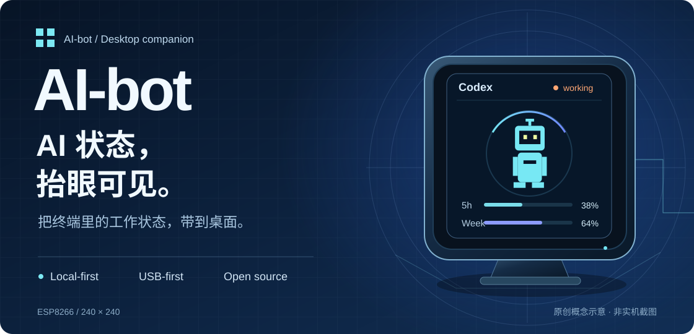
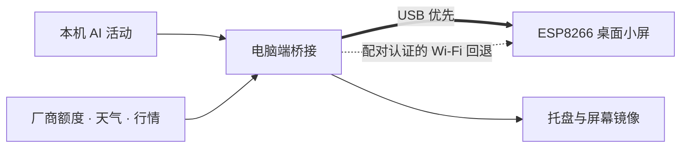

<p align="center">
  
</p>

<p align="center">
  <strong>一块小屏，连接你的 AI 工作流。</strong><br>
  看工作状态、查账户额度，也让天气、音乐和系统动态留在桌面。<br>
  <strong>Windows · macOS（Apple Silicon 测试版）</strong>
</p>

<p align="center">
  <a href="https://github.com/yaoyouzhong/AI-bot/actions/workflows/ci.yml"></a>
  <a href="LICENSE"></a>
  
  
</p>

<p align="center">
  <strong>简体中文</strong> · <a href="README.en.md">English</a><br>
  <a href="#桌面上的实时窗口">功能</a> ·
  <a href="#开始使用">开始使用</a> ·
  <a href="#当前进度">当前进度</a> ·
  <a href="#深入了解">开发文档</a>
</p>

---

## 把注意力留给正在做的事

终端里的任务正在运行，还是已经等你下一步？这周的额度还剩多少？
AI-bot 把这些状态放到一块 ESP8266 小屏上，让你抬眼就能看到。

电脑端桥接读取本地 Claude Code / Codex 活动与厂商额度，再送到桌面设备。
Windows 优先走 USB，常驻托盘；Mac 提供菜单栏桥接测试版。两端均有屏幕镜像，Mac 实机验收仍待完成。

Windows 的“桥接服务 → 开机启动”使用当前用户登录任务，延迟 5 秒启动，避开普通启动项队列；重复打开只保留一个桥接实例。旧版启动项需关闭后重新启用一次以迁移。

## 桌面上的实时窗口


<sub>以上均为原创概念示意，数值仅作展示；实际界面和完成度以代码及验收记录为准。</sub>

| 工作时，看得见进度 | 日常里，多一点陪伴 |
| :--- | :--- |
| **AI 工作状态**<br>Claude / Codex 工作、空闲与离线状态；等待输入提醒、主任务完成提示音。 | **天气与时钟**<br>城市天气、独立时钟和自动屏保；暂时断网时保留最近成功数据。 |
| **账户额度与余额**<br>Claude / Codex 用量、重置时间与额度明细；Windows 接入阿里、Kimi、MiniMax、DeepSeek、智谱。 | **音乐与行情**<br>正在播放的歌曲、封面和进度；A 股、港股、美股自选列表与翻页。 |
| **系统监控**<br>CPU、内存和上下行动态；实时网速曲线与镜像显示。 | **会动的桌宠**<br>原创 BYTE SPROUT；支持带许可说明的本地图片/GIF，Claude 与 Codex 可分别选择。 |

**按你的习惯显示。** 固定一个页面，或让额度、天气、股票等按自选顺序轮播。
屏保遇到工作事件临时唤醒；电脑离线而设备仍有供电时，显示 `PC OFF` 独立时钟。

<details>
<summary><strong>额度统计的边界</strong></summary>

账户额度来自厂商接口，本机 Token 数只覆盖本机可见日志，两者不会混算。
Windows 额度趋势保留近 90 天记录；按北京时间累计可核实的采样增量，
不完整日期也显示已记录时段用量，今天显示“统计中”；没有可比采样时显示 `--`。
仅完整历史日期计入日均，缺失时段不估算，额度变化无法核实不代表用户执行了重置。见[额度趋势说明](docs/QUOTA_TRENDS.md)。

</details>

## 本地优先，从连接开始



- **USB 直连**：自动探测串口并握手，460800 波特率；基础直连不要求局域网互通。
- **有边界的回退**：USB 失联后尝试配对的 LAN；网络必须可达，完整回退验收尚待完成。
- **保留有用的数据**：接口失败保留最近成功值，不把临时网络故障变成空白页面。

### 你的数据，按用途流动

会话日志只提取状态、模型、时间和 Token 元数据，不上传对话正文。
账户令牌只用于对应厂商接口，不进入显示缓存、串口数据或日志。
国产授权使用独立浏览器配置；私有桌宠、Cookie、账号缓存和配对数据不随仓库分发。
详见[数据来源与隐私](docs/DATA_SOURCES.md)及[资源导入规则](docs/ASSET_POLICY.md)。

## 开始使用

**Windows 推荐下载：** [联网精简安装包（约 8 MB）](https://github.com/yaoyouzhong/AI-bot/releases/download/v0.1.3/AIBotBridge-0.1.3-setup-win-x64.exe) · [中文安装图解](docs/WINDOWS_INSTALLER.md)。已有环境自动跳过，缺少时联网补装。

**第一次使用？** [下载哪个包](docs/DOWNLOAD.zh.md) · [Windows 安装图解](docs/WINDOWS_INSTALLER.md) · [Mac 测试版安装](docs/MAC_PACKAGE.md) · [Windows 刷机图解](docs/FLASH.zh.md) · [Mac 刷机指南](docs/FLASH_MAC.zh.md) · [全部功能与界面图鉴](docs/FEATURES.zh.md)

默认自带 BYTE SPROUT，无需导入桌宠。下面是实际 Windows 镜像渲染，数据为虚构样例；不是实体屏照片。

<table>
<tr>
<td align="center"><br><strong>Codex 额度</strong></td>
<td align="center"><br><strong>天气时钟</strong></td>
<td align="center"><br><strong>系统监控</strong></td>
</tr>
<tr>
<td align="center"><br><strong>双额度总览</strong></td>
<td align="center"><br><strong>音乐播放</strong></td>
<td align="center"><br><strong>股票行情</strong></td>
</tr>
</table>

> **v0.1.3 测试版：Windows 联网精简安装包约 8 MB。** 缺少运行环境时需要联网，已有正常固件不用重刷。
> 安装器未签名；全新电脑安装、升级与卸载仍待实测。Mac 为 Apple Silicon 测试版，尚未完成实机验收。

### 准备硬件

ESP8266 / ESP-12S，适配 240×240 ST7789 的 SD2 小电视引脚方案，以及一根 **USB 数据线**。
其他板卡须先核对屏幕驱动和引脚。详见[固件配置](firmware/platformio.ini)。

### Windows：构建本地候选

准备 Git、Python 和 .NET 8 SDK，然后运行：

```powershell
git clone https://github.com/yaoyouzhong/AI-bot.git
cd AI-bot
powershell -NoProfile -File scripts/package_windows_local.ps1
```

脚本会在 `artifacts/` 下生成 Windows 安装 EXE、完整 Windows ZIP 和公开源码 ZIP，附许可、校验文件，
并执行解压回归。加上 `-Firmware` 可同时生成固件及对应源码材料；需要 PlatformIO 6.1.18。

联网精简安装 EXE 按中文向导检测并补齐缺失环境。选择手动 ZIP 时，完整解压并按教程准备 **.NET 8 Desktop Runtime x64**；国产网页授权需要 **WebView2 Runtime**。从资源管理器打开 `AIBotBridge.exe`，不要只复制 EXE。刷写固件前先退出桥接，释放串口。

[Windows 安装与升级](docs/WINDOWS_PACKAGE.md) · [固件构建与重建](docs/FIRMWARE_PACKAGE.md) · [完整开发与运行参考](docs/REFERENCE.zh.md)

### macOS：Apple Silicon 测试版

面向 macOS 13+、M 系列芯片。可从[v0.1.3 测试版](https://github.com/yaoyouzhong/AI-bot/releases/tag/v0.1.3)下载 `AIBotBridge-0.1.3-local-candidate-macos-arm64.zip` 和同名 `.sha256`；
解压并校验后，将 `.app` 放入“应用程序”。详见 [Mac 安装说明](docs/MAC_PACKAGE.md)。
目前仅临时签名，未完成 Developer ID 签名与 Apple 公证；首次启动、权限和设备行为待实机验证，Intel Mac 未验证。

## 当前进度

| 平台 / 环节 | 当前证据 | 仍需完成 |
| :--- | :--- | :--- |
| **Windows** | 联网精简安装器、本机环境检测、下载校验与公开隔离回归通过 | 全新安装、真实授权、持续运行与全部交互验收 |
| **ESP8266** | 固件构建、源码材料重建及 CI 通过；已有分项实机验证 | 实体屏逐页确认、音乐及完整 Wi-Fi 回退 |
| **macOS（Apple Silicon 测试版）** | 自动化测试、Release 编译和 `.app` 打包由云端验证，运行记录见 Actions | 首次启动、权限、设备连接、持续运行；Developer ID 签名与公证；Intel 未验证 |
| **公开分发** | 安装 EXE、Windows/Mac ZIP、固件材料与源码按标签打包，附许可及 SHA-256 | 真实重启自启动、全新安装、Mac 实机及完整设备验收 |

候选安装与验收：[Mac 候选包](docs/MAC_PACKAGE.md) · [发布准备状态](docs/RELEASE_READINESS.md) · [候选验收表](docs/CANDIDATE_ACCEPTANCE.md)

文档更新：2026-09-16，版本 **v0.1.3**。
持续更新以[Actions](https://github.com/yaoyouzhong/AI-bot/actions)与[发布前检查](docs/RELEASE_READINESS.md)为准。

## 深入了解

| 想了解什么 | 从这里开始 |
| :--- | :--- |
| 功能、命令和平台差异 | [功能与开发参考](docs/REFERENCE.zh.md) |
| 架构、数据与缓存 | [开发说明](docs/DEVELOPMENT.md) · [数据来源](docs/DATA_SOURCES.md) |
| 串口、资源传输与回退 | [协议](docs/PROTOCOL.md) · [USB 验收](docs/USB_VALIDATION.md) |
| 功能完成度与已知限制 | [对齐矩阵](docs/FUNCTIONAL_PARITY.md) · [验收审计](docs/FULL_PARITY_AUDIT_2026-09-09.md) |
| 源码来源与分发 | [来源记录](PROVENANCE.md) · [第三方声明](THIRD_PARTY_NOTICES.md) · [分发条款](docs/DISTRIBUTION_TERMS.md) |
| 最近改动 | [更新日志](CHANGELOG.zh.md) |

欢迎通过 [Issues](https://github.com/yaoyouzhong/AI-bot/issues)反馈。
描述问题时附上平台、版本、设备型号和复现步骤；请移除账号、令牌和私人日志内容。

---

<p align="center">
  <strong>AI-bot</strong><br>
  为桌面上的 AI 工作流，留一扇窗口。<br><br>
  <a href="LICENSE">自有源码 MIT</a> · 原创 BYTE SPROUT · 本地优先<br>
  <sub>独立项目，与所提及的 AI 厂商无隶属或背书关系。第三方组件遵循各自许可。</sub>
</p>
