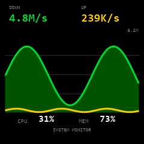
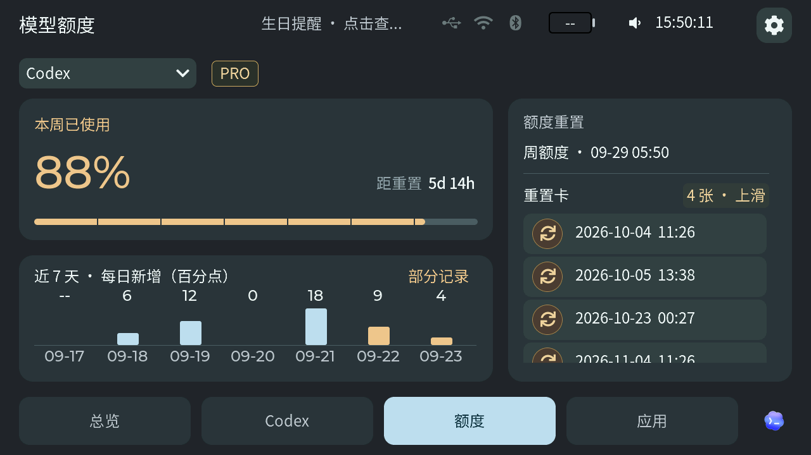

# AI-bot

准备中的公开候选为 Windows 桥接 **0.5.1**、TAB5 **0.2.143-ui**。每日名画和每日书法仅供本地使用，公开版不提供入口、下载服务或作品集；现有本地安装及图库保留。十二月历花卉更新仍在公开候选范围内。候选状态与验证边界见[发布准备记录](docs/RELEASE-CANDIDATE-0.5.1.md)。

**AI 状态，一眼便知。** 桌面 AI 状态助手，将 Claude Code / Codex 任务状态、账户额度与日常信息，集中显示在 **ESP8266 小屏或 M5Stack TAB5** 上。

[**下载 v0.5.0 正式版**](https://github.com/yaoyouzhong/AI-bot/releases/tag/v0.5.0) · [安装与刷机指南](docs/INSTALL.zh.md) · [English](README.en.md)

Windows 与 ESP8266 版本为 **0.5.0**，TAB5 使用独立编号的 **0.2.89-ui** 固件。维护者已于 2026-10-03 确认真机验收，v0.5.0 为当前稳定版，详见[发布记录](docs/RELEASE-0.5.0.md)。

桥接和两种固件分别更新，版本号无需相同；只按对应更新说明升级，无需每次一起刷机。[独立版本说明](docs/COMPONENT-VERSIONS.md)。

Windows 0.5.1 候选新增统一的「软件与固件更新」入口：自动提醒各组件的新版本，选择设备后下载并校验适用包，再进入安装工具。已安装 AI-bot 的 TAB5 自动选升级包；首次安装仍通过设备中心完成。[后续更新用法](docs/UPDATES.md)。

开发候选新增 [TAB5 Codex 直达](docs/TAB5-QUICK-CONSOLE.md)：右下角常驻入口，每次打开最新 Codex 会话，豆包语音识别文字仅填入电脑草稿，等待手动发送。用户已确认 0.2.90-ui 语音回填，0.2.92-ui 新入口与最新会话行为待真机验收。

 · 96 秒产品介绍（桌宠设计预览）

https://github.com/user-attachments/assets/31393f58-edd9-4a50-a81f-0e8d0ff72a80

[下载新版视频（96 秒）](https://github.com/yaoyouzhong/AI-bot/raw/refs/heads/main/docs/assets/product-intro/AI-bot-product-intro.mp4) · [视频与截图来源](docs/PRODUCT_VIDEO.md)

[下载桌宠动画包](docs/assets/pet/AI-bot-pet.zip) · [预览 GIF](docs/assets/pet/AI-bot-mascot.gif) · [导入说明](docs/assets/pet/README.md)

新版桌宠仅用于本轮截图与视频的设计展示，程序、固件和个人设置保持现状。GitHub 在线播放器与仓库 MP4 均使用新版桌宠设计预览。

## 桌面上的实时窗口

电脑端桥接读取本地 AI 活动与厂商额度，再送到桌面设备。Windows 常驻托盘，macOS 提供菜单栏应用和屏幕镜像；设备功能按平台能力提供。

| 功能 | 显示与操作 |
| --- | --- |
| AI 工作状态 | Claude / Codex 工作、空闲、离线与等待输入，任务完成提醒 |
| 额度与余额 | 账户用量、重置时间、支持的厂商余额与已采集额度趋势 |
| 日常信息 | 天气、时钟、股票、系统监控与正在播放的音乐 |
| 桌宠与显示 | 原创 BYTE SPROUT、亮度、指定页面与自动轮播 |
| TAB5 交互 | 触摸界面、任务与历史、语音输入、日历生日与常用任务 |

<table>
<tr>
<td align="center" width="33%"><strong>AI 额度与桌宠</strong>   额度、重置时间与动画角色</td>
<td align="center" width="33%"><strong>天气时钟</strong>   城市天气、温度与湿度</td>
<td align="center" width="33%"><strong>股票行情</strong>   自选股票、报价与涨跌幅</td>
</tr>
<tr>
<td align="center" width="33%"><strong>系统监控</strong>   处理器、内存与实时网速</td>
<td align="center" width="33%"><strong>音乐播放</strong>   歌曲信息与播放进度</td>
<td align="center" width="33%"><strong>农历屏保</strong>   时间、星期与农历日期</td>
</tr>
</table>

以上采用原生 Windows 镜像布局与固定演示数据；新桌宠为设计预览，程序与固件默认形象尚未替换，并非实体屏照片。

### 两种硬件，一个 Windows 设备中心

**我的设备 / 账号数据 / 桥接设置**分别管理设备、共享账号和电脑服务。可同时添加一台 ESP8266 与一台 TAB5，连接独立管理，数据源共享。

- **ESP8266 小屏**：240×240 ST7789、SD2 引脚方案；自动模式优先 USB，失联后回退至已配对 Wi-Fi，也可指定仅 USB 或仅 Wi-Fi。
- **TAB5**：触摸屏，支持 USB / Wi-Fi / BLE；自动连接优先 USB > Wi-Fi > BLE，首次安装使用 USB。
  本地 .117 OTA 候选支持 Wi-Fi / USB / 蓝牙协商压缩及蓝牙升级入口；升级自动择优为 Wi-Fi > USB > BLE，固定模式保持所选通道。内部验证与三通道真机升级验收分开记录，见 [TAB5 更新日志](docs/development/TAB5-CHANGELOG.zh.md)。
- 托盘左键打开已启用 ESP8266 的预览，否则打开设备中心；右键提供设备设置。开机启动位于 **设备中心 → 桥接设置**。

<strong>额度统计的边界</strong>

账户额度来自厂商接口，本机 Token 数只覆盖本机可见日志，两者不会混算。
Windows 额度趋势保留近 90 天记录；按北京时间累计可核实的采样增量，
不完整日期也显示已记录时段用量，今天显示“统计中”；没有可比采样时显示 `--`。
仅完整历史日期计入日均，缺失时段不估算，额度变化无法核实不代表用户执行了重置。见[额度趋势说明](docs/QUOTA_TRENDS.md)。

### 本地数据与额度边界

活动采集只从本地日志提取状态、模型、时间与 Token 元数据，不上传对话正文。账户额度来自厂商接口，本机 Token 总数只覆盖本机可见日志，两者分开统计。请求失败保留最近成功的显示数据。

Windows 额度历史保留近 90 天采样；缺失时段不估算，无法核实的变化保留不确定标记。厂商接入需要对应的有效账号与授权。详见[额度趋势](docs/QUOTA_TRENDS.md)、[数据来源与隐私](docs/DATA_SOURCES.md)及[资源导入规则](docs/ASSET_POLICY.md)。

## 开始使用

**安装应用 → 确认硬件 → 选择首刷或升级 → 备份、写入与核验 → 添加并配对。** 操作步骤见[完整图文指南](docs/INSTALL.zh.md)。

| 下载 | 平台或用途 |
| --- | --- |
| [Windows 安装器](https://github.com/yaoyouzhong/AI-bot/releases/download/v0.5.0/AIBotBridge-0.5.0-setup-win-x64.exe) | Windows 10/11 x64，内置刷机工具 |
| [Mac 应用](https://github.com/yaoyouzhong/AI-bot/releases/download/v0.5.0/AIBotBridge-0.5.0-local-candidate-macos-arm64.zip) | macOS 13+，Apple Silicon |
| [ESP8266 固件包](https://github.com/yaoyouzhong/AI-bot/releases/download/v0.5.0/AI-bot-0.5.0-firmware-materials.zip) | 固件及对应源码、重建材料 |
| [TAB5 首刷 ZIP](https://github.com/yaoyouzhong/AI-bot/releases/download/v0.5.0/TAB5-first-install-0.2.89-ui.zip) | 出厂设备首次安装，含完整安装镜像 |
| [TAB5 升级 ZIP](https://github.com/yaoyouzhong/AI-bot/releases/download/v0.5.0/TAB5-upgrade-0.2.89-ui.zip) | 已有 AI-bot 的设备，解压后选择 `aibot_tab5.bin` |

[SHA-256 校验清单](https://github.com/yaoyouzhong/AI-bot/releases/download/v0.5.0/SHA256SUMS.txt)覆盖以上五个包，许可与第三方声明已包含在包内。历史版本见 [Releases](https://github.com/yaoyouzhong/AI-bot/releases)。

**第一次刷 TAB5 也是 0.2.89-ui。** 选择完整首刷 ZIP，其中包含启动程序、分区与应用；单独应用 BIN 不能初始化出厂设备。后续升级保留 BIN 同目录的更新说明 sidecar。

准备 USB 数据线；ESP8266 核对 ST7789 / SD2 引脚，TAB5 使用 USB-C 数据接口。完成后核验真实屏幕与连接，恢复自动展示，保留轮播页面、顺序与间隔。

已安装 Windows 的用户先退出桥接，再安装到原位置，继续使用原快捷方式。Windows 安装器未签名；Mac 应用为临时签名且未公证，Intel Mac 未验证。Mac 刷机窗口当前面向 ESP8266，本文 TAB5 首刷、配对与升级流程属于 Windows 功能。

## 当前进度

| 组件 | 当前版本与范围 |
| --- | --- |
| Windows 0.5.0 | 设备中心、双硬件、共享账号与独立设备设置 |
| ESP8266 0.5.0 | 显示页面、时钟、桌宠、USB / Wi-Fi 与轮播 |
| TAB5 0.2.89-ui | 触摸、任务与历史、语音、日历及 USB / Wi-Fi / BLE |
| macOS 0.5.0 | Apple Silicon 菜单栏桥接、镜像与 ESP8266 刷机 |

维护者已于 2026-10-03 确认真机验收。Windows 构建与公开回归、macOS 测试与构建、ESP8266 构建均通过[发布流水线](https://github.com/yaoyouzhong/AI-bot/actions/runs/37091169252)。正式发布不新增性能测量结论，也不抹除历史问题，细节保留在[发布记录](docs/RELEASE-0.5.0.md)。

## 深入了解

| 想了解什么 | 从这里开始 |
| --- | --- |
| 安装与两种硬件刷机 | [图文指南](docs/INSTALL.zh.md) |
| 功能与平台差异 | [功能参考](docs/REFERENCE.zh.md) |
| 架构、数据与协议 | [开发说明](docs/DEVELOPMENT.md) · [数据来源](docs/DATA_SOURCES.md) · [协议](docs/PROTOCOL.md) |
| TAB5 源码与构建快照 | [开发者源码说明](docs/development/TAB5-SOURCE.md) · [固件工作流](docs/TAB5-FIRMWARE-WORKFLOW.md) |
| 来源与许可 | [来源记录](PROVENANCE.md) · [第三方声明](THIRD_PARTY_NOTICES.md) · [TAB5 许可范围](docs/TAB5-LICENSE-SCOPE.md) |
| 最近改动 | [更新日志](CHANGELOG.zh.md) |

自有代码（含 TAB5）统一 **MIT 开源**，第三方组件、字体和标识保留原条款。项目独立开发，与提及的 AI 厂商无隶属或背书关系。

欢迎通过 [Issues](https://github.com/yaoyouzhong/AI-bot/issues)反馈，附平台、版本、硬件与复现步骤，并移除凭据与私人日志。
