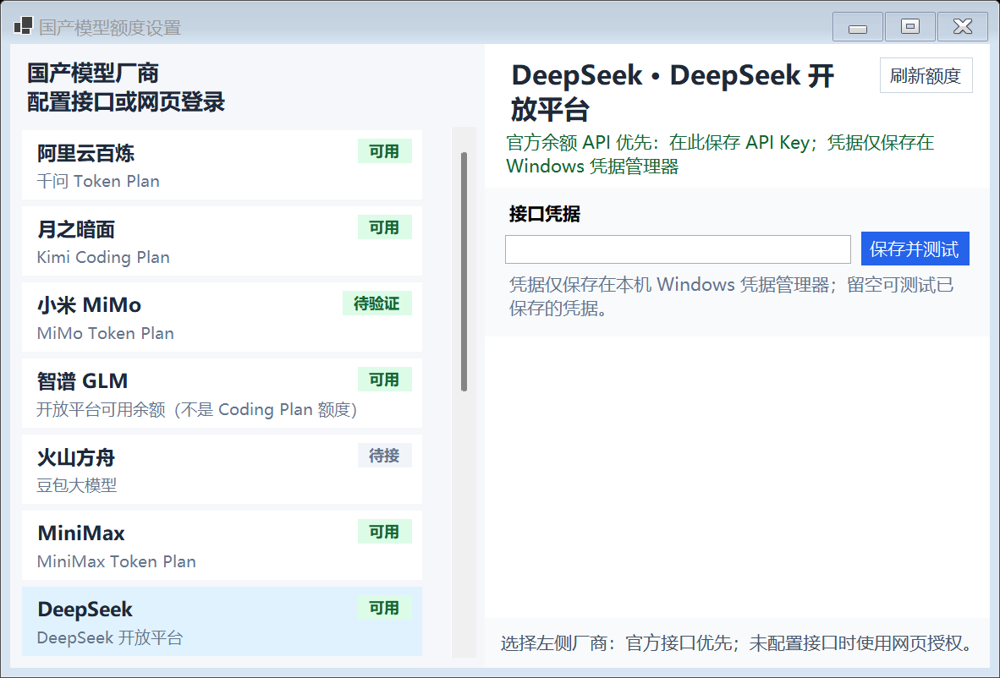

# 国产模型额度设置

> 本功能包含在 v0.2.0 测试版中。适用于 Windows 桥接 App；设备的缓存提示需要更新固件。

## 在哪里配置

右键托盘 AI-bot → **模型额度 → 国产模型额度设置…**，选择左侧厂商。

- **DeepSeek**：在 [官方开放平台](https://platform.deepseek.com/) 的 API Keys 页面创建 Key，粘贴到桥接 App，点击“保存并测试”。成功后显示 API 查询到的币种和余额。查询口径为赠送余额加充值余额，不是账单累计消费。
- **MiniMax**：在 [Token Plan 页面](https://platform.minimaxi.com/subscribe/token-plan) 获取对应的 Token Plan / Subscription Key，保存并测试；不要混用海外区域或普通按量付费 Key。
- **Kimi Code**：优先支持官方 `kimi web` 本地服务的额度 API。需先运行并登录该服务，将其访问令牌与端口填入桥接 App（默认端口 58627，实际以服务为准）。这里不是填写 Moonshot 按量付费 Key，也不读取其他工具的凭据文件。没有使用该服务时，保留网页授权。
- **阿里 Token Plan、智谱账户余额**：目前未确认有适用于这两个统计口径的公开查询 API，继续在右侧官方页面登录。阿里账户现金余额不能替代 Token Plan 额度；智谱 Coding Plan 用量不能替代账户余额。

API Key/本地服务令牌只保存在 Windows 凭据管理器。输入框为密码框；留空后点击“保存并测试”会测试已保存的凭据。不要将 Key 发到聊天、截图或代码仓库。Kimi 端口是普通设置，不是秘密。

配置接口后，后台优先使用接口；接口失败不会悄悄改用另一个网页登录账号覆盖余额。接口尚未配置时使用原网页方式。凭据填错时重新填写正确值并保存测试即可。

## 刷新与故障提醒

- 已选中且已配置的官方接口每两分钟尝试查询；已选中且成功授权过的网页按厂商轮询，避免同时切换同一个浏览器。托盘“刷新”会查询已配置的 API，并刷新当前选中的网页厂商。
- 网络失败、401/403、限流、无法识别的响应不会覆盖上次成功数据。限流按五分钟退避，网页超时约一分钟后报告。
- 网页跳转登录页、相关接口拒绝授权、浏览器进程中断、超时都会进入统一故障状态。只有当前轮播选中的国产页面，或当前指定的单个国产页面，并且已成功授权取数或配置了 API 凭据，才自动检查和弹窗提醒；其他厂商不弹提醒。
- 同一次故障只提醒一次，成功后解除；再次失效可重新提醒。多个厂商同时失败时，通知间隔至少 30 秒，避免相互覆盖。Windows 通知设置可能阻止气泡显示，但界面仍保留缓存提示。
- Windows 镜像将旧数据标为“缓存数据 · 等待更新”，并显示上次更新时间；设备显示 `CACHED - CHECK APP`。余额保留，不冒充实时值。
- 通常超过六分钟没有新数据会提示；选中多个网页厂商时，超时门槛会覆盖完整轮询周期，避免轮询尚未轮到就误报。官方余额 API 不返回累计消费，因此不会把旧的 USED 金额与新的余额拼在一起。

## 已核实的接口与边界

| 厂商 | 当前优先路径 | 官方依据 |
|---|---|---|
| DeepSeek | `GET https://api.deepseek.com/user/balance` | [官方余额 API](https://api-docs.deepseek.com/api/get-user-balance/) |
| MiniMax 中国站 | `GET https://www.minimaxi.com/v1/token_plan/remains` | [官方 Token Plan 页面“如何查看用量”](https://platform.minimaxi.com/subscribe/token-plan) |
| Kimi Code | `GET http://127.0.0.1:<port>/api/v1/oauth/usage` | [官方本地 Server API](https://www.kimi.com/code/docs/en/kimi-code-cli/reference/server-api.html)，实验接口，版本变化可能需要适配 |
| 阿里 Token Plan | 已登录的百炼网页响应 | [官方 Token Plan FAQ](https://help.aliyun.com/zh/model-studio/token-plan-personal-faq)，未确认公开的对应额度 API |
| 智谱可用余额 | 已登录的财务总览响应 | [官方费用说明](https://docs.bigmodel.cn/cn/faq/fee-issues)，未确认公开的账户余额 API |

这里的 API 指有官方依据且统计口径相符的接口；不把第三方脚本使用的私有地址包装成“官方公开 API”。目录中尚未接入的其他厂商仍标记“待接”。

测试使用模拟 HTTP 与隔离配置，不代表已用真实 Key 完成五个厂商的在线验收，也不代表当前驻留程序已经升级。

## English

Windows: open **Model quotas → Domestic quota settings**, select a provider, then save and test its credential. DeepSeek uses its official total-balance endpoint; MiniMax uses the China Token Plan endpoint. Kimi Code optionally uses the documented local `kimi web` usage API with its server bearer token and port, not a Moonshot wallet key. Ali Token Plan and Zhipu account balance retain authenticated browser collection because no matching documented public endpoint has been confirmed.

Credentials stay in Windows Credential Manager. Selected, configured APIs take priority every two minutes; failed APIs never silently switch accounts through the browser. Browser fallback reports login redirects, authorization denial, process failure and timeout. Last-good data is retained and marked stale; notifications are deduplicated until recovery. The tray refresh command uses the same selected-and-configured provider scope. Unconfigured or unselected catalog entries do not trigger automatic checks or tray warnings. Real-account integration and deployed/hardware acceptance remain separate from simulated tests. Included in the v0.2.0 pre-release.

## 新增厂商接入进度（v0.2.0 测试版）

只有模型专属额度进入显示；腾讯云、华为云、百度智能云、火山引擎的云账号总余额不接入。

- **阶跃星辰**：选择厂商，填写普通开放平台 API Key，点击“保存并测试”。查询开放平台人民币余额，**不是 Step Plan 套餐额度**。接口实现及模拟测试已补齐，真实账号尚未验证。
- **百度千帆**：填写安全认证 AK、SK 和已购买的**模型资源包 ID**（packageId），点击“保存并测试”。只查询指定资源包，不读取云余额，不合并不同模型、单位和有效期的量包；不要填写音视频/插件资源包 ID。三项全部留空可以测试已保存配置；部分填写会被拒绝。三项配置整体保存在 Windows 凭据管理器。显示已用比例、模型名称和到期时间（EXPIRES）；过期或耗尽不显示可用余量。该接口不是千帆 Token Plan 订阅接口。真实账号尚未验证。
- **火山方舟、腾讯混元、华为盘古、讯飞星火、百川、零一万物**：保留待接入状态。还没有与当前模型套餐匹配且能完成验证的查询实现；网页登录入口不代表额度采集已完成。没有用户已开通的套餐可用于核对登录后字段，不通过猜测字段或抓取云余额来填充数字。

依据：[阶跃账户信息](https://platform.stepfun.com/docs/zh/api-reference/accounts/get)、[百度千帆指定量包查询](https://cloud.baidu.com/doc/qianfan/s/3mh4sv4ve)、[百度 BCE 签名规范](https://cloud.baidu.com/doc/Reference/s/njwvz1yfu)、[MiMo Token Plan 官方说明](https://mimo.mi.com/docs/zh-CN/quick-start/faq/token-plan)。核查日期：2026-09-16。

Windows 与 ESP8266 新增阶跃余额/千帆量包显示页；旧固件需要更新才能显示。未执行刷机；构建不代表真机验收。macOS 仅同步可选协议字段与模式名称，未实现这两家的原生查询入口。

### Additional providers (v0.2.0 pre-release)

Only model-specific quotas are eligible. Whole-cloud wallets from Tencent, Huawei, Baidu and Volcengine are excluded.

StepFun uses its ordinary API key and documented `GET /v1/accounts` endpoint for the CNY API wallet, **not Step Plan**. Baidu uses AK/SK and an explicit model package ID with `POST /v2/charge?Action=DescribePackageResource`; it displays utilization and expiry for that package, never cloud funds or an aggregate of incompatible packages. It is not a Token Plan subscription endpoint. Enter all three fields together, or leave all empty to test saved credentials. Credentials stay in Windows Credential Manager. Expired/exhausted packages have no usable remainder. Both adapters have simulated-response tests; neither has live-account acceptance.

Volcengine Ark, Tencent Hunyuan, Huawei Pangu, iFlytek Spark, Baichuan and Yi remain pending: no verified model-specific adapter is enabled. A login link alone is not completed collection. Current users have no purchased plans for live browser verification. Firmware adds two display modes; flashing and hardware acceptance are pending. macOS only adds protocol compatibility, not native acquisition for these providers.

## 小米 MiMo（网页登录，待真实套餐验证）

入口：模型额度 → 国产模型额度设置 → 小米 MiMo。在内嵌官方页面登录并打开 Token Plan 用量页。显示的是套餐 Credits 的**已用比例**，不是人民币余额，也不是按量调用的 Token 数。当前未确认有公开 API Key 用量查询契约，因此没有增加伪造的 Key 查询入口。

已接通官方控制台 `/api/v1/tokenPlan/usage` 响应采集、缓存、后台刷新、失效状态、Windows 镜像及 ESP8266 `domestic_xiaomi` 页面。地址必须是 HTTPS 官方精确主机与路径；HTTP 错误、登录错误、字段不明确、冲突计数和无套餐响应不覆盖旧值。解析规则仅接收明确的 `usagePercent`/`usedPercent`（0–100）、`usageRate`/`usedRate`（0–1），或 `totalCredits` 配合 `usedCredits`/`remainingCredits`，不递归猜测通用 `ratio`、钱款或限速字段。这些字段兼容规则已通过模拟测试，当前真实账号响应结构仍待验证；不匹配会明确报失败。

**提醒规则适用于全部国产厂商**：自动轮播开启时，只监测轮播列表中的国产页；指定单页时，只监测该页，不把保留的轮播列表也算进去。还必须有过成功授权取数，或已保存接口凭据。首次登录/保存测试的结果在当前窗口展示，但未配置厂商不弹托盘失效提醒。未选中厂商的故障不会阻塞其他提醒；重新选中时，如仍有故障且符合配置条件，再提醒一次。成功恢复后结束本次故障。

### MiMo and reminder scope

MiMo now has a console-session adapter, cached plan utilization, refresh health, mirror rendering and optional ESP8266 mode `domestic_xiaomi`. Sign in using the official embedded Token Plan page; no undocumented API-key endpoint is presented. This is Credits utilization, not wallet funds or raw token counts. Only the exact HTTPS console host and usage path are accepted. The explicit percentage/rate/Credits parser rejects ambiguity, conflicts and unrelated nested fields. Simulated contracts passed; the current live payload has not been verified with a subscribed account. Unknown shapes retain old data and report failure.

All domestic background checks and tray warnings require **both** an active selection (enabled automatic cycle, or the explicitly selected single domestic page) **and** previous successful authorization or stored API credentials. Never-configured and unselected providers remain silent. Manual login/test results still appear in the settings window. Staleness covers a complete browser polling round, with a six-minute minimum. Recovery resets episode deduplication.
