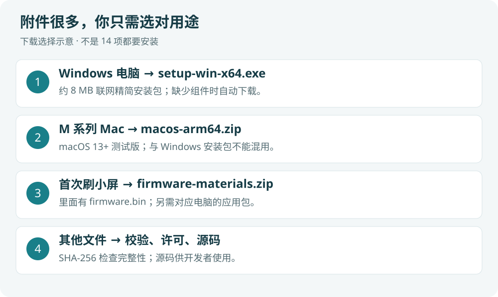

# 第一次使用：只下载需要的包

**Windows 普通用户下载联网精简安装包，约 8 MB。** 双击后按中文向导操作，已有运行环境会跳过，缺少时自动联网下载并安装。

本版：[v0.2.0 测试版发布页](https://github.com/yaoyouzhong/AI-bot/releases/tag/v0.2.0)。附件包含不同系统的应用、固件、源码和校验材料，**不用全部下载**。

| 你要做什么 | 文件名结尾 | 下一步 |
| --- | --- | --- |
| Windows 安装（推荐） | `setup-win-x64.exe` | [中文安装向导](WINDOWS_INSTALLER.md) |
| Windows 手动解压 | `win-x64.zip` | [ZIP 安装图解](INSTALL.zh.md) |
| M 系列 Mac 使用 | `macos-arm64.zip` | [Mac 安装说明](MAC_PACKAGE.md) |
| 首次给兼容小屏刷 AI-bot | `firmware-materials.zip`，另需对应电脑应用包 | [Windows 刷机](FLASH.zh.md) / [Mac 刷机](FLASH_MAC.zh.md) |
| 研究或修改代码 | `source.zip` | 源码和构建说明 |

`.sha256` 是同名 ZIP 的校验文件，不是程序。`SHA256SUMS.txt` 是总校验清单，`BUILD.json` 记录版本来源，`LICENSE` 和 `THIRD_PARTY_NOTICES.md` 是许可声明。普通使用不必逐个打开。

固件包约 30 MB，因为包含现成 `firmware.bin`、源码、依赖及许可。实际只写入固件，不会把整个 ZIP 写进小屏。

**只需电脑上的额度功能，可只更新 Windows 包；要在小屏显示农历和新增模型页面，请同时更新固件。**
