# 功能与真实界面图鉴

[返回首页](../README.md) · [安装图解](INSTALL.zh.md) · [刷机图解](FLASH.zh.md) · [直接看界面](#pages)

这里展示**当前 Windows 程序自身的渲染结果**：240×240 页面调用实际镜像渲染器，
窗口由真实 WinForms 控件离线绘制。数据全部为虚构样例，授权页不加载厂商网页，
图库不下载任何第三方素材。不是实体屏照片，也不是已经完成全功能验收的声明。

首次使用无需导入桌宠：没有自选素材时使用原创 **BYTE SPROUT**；用户已经选择的动画优先保留。
本次默认回退修改需要更新电脑程序和固件才会生效，不能仅看旧版本运行画面。

## 1. 日常操作总入口

右键托盘有七组菜单，左键直接打开镜像。以下清单覆盖当前用户可见功能；
内部协议和开发测试另见[开发参考](REFERENCE.zh.md)。

- **模型额度**：Claude/Codex 5H、周额度、套餐、重置倒计时；Codex 重置次数及逐笔到期时间。入口：模型额度查看摘要；显示模式选择角色/双额度；需要对应账号可用授权。

- **额度趋势**：7/30 天视图、每日用量/5H 快照、趋势图和数据明细。入口：模型额度 → Codex 额度趋势…，或镜像底部按钮；仅 Windows 本机历史。

- **国产额度**：阿里 Token Plan、Kimi、MiniMax、DeepSeek、智谱 GLM。入口：模型额度 → 国产模型额度授权…；按厂商支持范围刷新。

- **设备连接**：自动/指定串口、设备信息、显示模式、亮度、Wi-Fi 回退诊断、Wi-Fi 重置。入口：设备连接菜单；控制和管理需 USB 握手；重置另行确认。

- **显示模式**：智能跟随、单/双额度、国产、系统、音乐、股票、天气、桌宠、AI 活动。入口：显示模式菜单；镜像快捷按钮只覆盖常用页面。

- **循环展示**：勾选页面、调整顺序、10/15/30/60 秒间隔。入口：循环展示 → 调整展示顺序…；需处于智能跟随模式。

- **天气**：城市、定位、天气源、温度、湿度、日期时钟与右下角动画。入口：内容设置 → 设置天气；网络失败保留最近成功数据。

- **股票**：A/H/美股，最多 20 只，每屏 4 行，自动翻页。入口：内容设置 → 设置自选股…；代码前缀与示例见安装教程。

- **系统**：CPU、内存、上/下行速率、网速曲线。入口：显示模式 → 系统监控；不需厂商账号。

- **音乐**：播放状态、标题、歌手、进度、可用封面；播放时自动优先展示。入口：显示模式 → 音乐播放；播放器须提供 Windows 系统媒体会话信息。

- **桌宠**：原创默认动画、按角色自选本机图片/GIF、petdex 图库、恢复已有本机默认。入口：桌宠与外观菜单；导入是可选换肤；公开包不附私人/第三方角色素材。

- **屏保**：立即预览、空闲定时、AI/音乐临时唤醒、键鼠恢复。入口：显示模式 → 屏保；独立屏保模式，不是把亮度调成 0。

- **活动与提醒**：工作/空闲/离线、等待输入提示、任务完成提示与确认、本机今日 Token。入口：显示模式 → AI 活动状态；桥接服务 → 确认任务完成提醒。

- **桥接服务**：刷新、当前状态、服务地址、全部设置、开机启动、退出。入口：桥接服务菜单；程序移动后重新设置开机启动。

## 2. Claude、Codex 与双额度

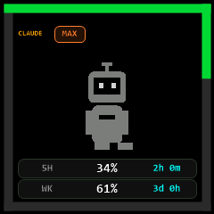
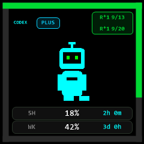
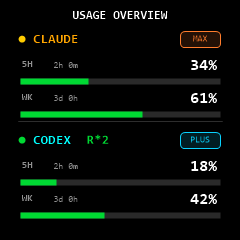

入口：**显示模式 → Claude / Codex / Claude + Codex 额度**。
`5H` 为五小时窗口使用比例，`WK` 为周窗口使用比例；数值不是“剩余比例”。
`R*` 是可用重置次数，日期表示接口提供的逐笔到期日。未知字段显示 `--`，不会凭空补齐。
单/双页面字段多少取决于实际账号返回内容。

先确保本机 CLI 已登录，再点**桥接服务 → 刷新状态**。账号没有相关计划、授权过期、厂商限流等情况，
可能没有额度；本机工作状态与账户额度是两条独立数据源。

## 3. 国产模型额度与授权

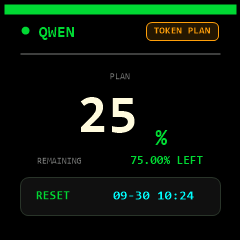
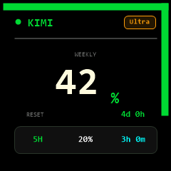
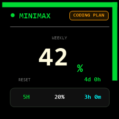
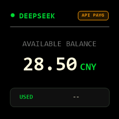
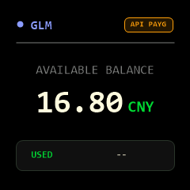

入口：**显示模式 → 国产模型 → 对应厂商**。
授权入口是 **模型额度 → 国产模型额度授权…**，在左侧选择厂商，再在右侧完成自己的登录。

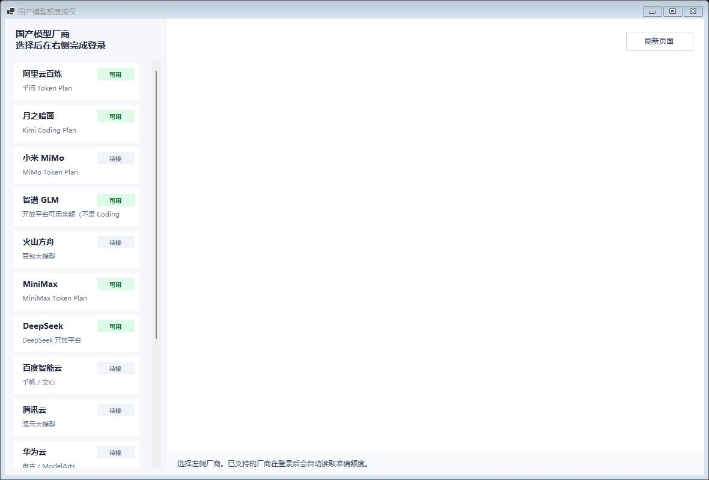

此图只展示应用自己的导航和状态区；右侧没有加载网页，不能把空白部分理解为登录后的实际页面。
**菜单列出厂商，不代表都已支持采集**。目前支持采集的是阿里、Kimi、MiniMax、DeepSeek、智谱；
其他入口不能按完整额度能力宣传。GLM 展示的是开放平台可用余额，**不是 Coding Plan 剩余额度**。
MiniMax 也提供 Key 路径，具体字段以当前授权窗口为准。

令牌和 Cookie 留在自己的授权环境中；共享截图、日志或设置前移除敏感数据。
详见[数据来源](DATA_SOURCES.md)与 [GLM 边界](GLM_BALANCE.md)。

## 4. 天气、股票、系统与音乐

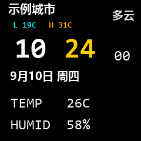
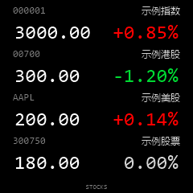
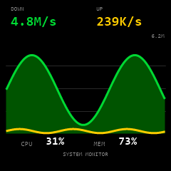
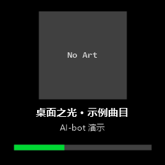

- **天气**：内容设置 → 设置天气 → 数据源与定位…，设置城市及需要的数据源，点击保存并刷新。
  可按硬件显示习惯选择天气机器人、小屋、盆栽、萌宠或关闭右下动画。离线样例只用于展示主布局，动画效果以运行程序为准。
- **股票**：内容设置 → 设置自选股…，逗号分隔输入代码后保存并重启。超过四只时每五秒翻页；抓取失败保留最近成功值。样例报价不是真实行情。
- **系统**：显示模式 → 系统监控。Windows 网速曲线每 250ms 采样，数字每两秒更新；系统和网络指标不表示 AI 厂商服务器的负载。
- **音乐**：在支持系统媒体会话的播放器播放歌曲，进入音乐页观察。封面未提供时会显示 `No Art`，
  不是程序必须下载一张封面；切歌中文文字与封面还需经设备资源链路同步。AUTO 会随播放状态切换。

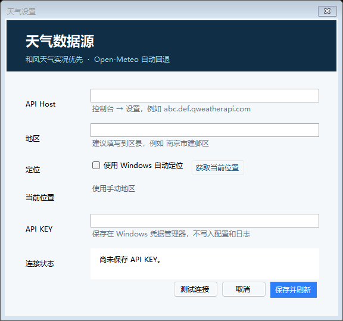

## 5. 默认桌宠、换肤与图库

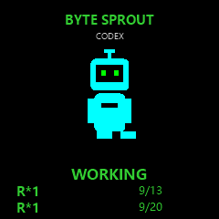
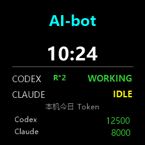

**默认即可用。** BYTE SPROUT 由程序几何图形绘制，不需要下载文件，不依赖厂商账号。
工作时有动画，空闲时待机；单角色额度页和独立桌宠页都可在没有导入素材时显示默认角色。

换自己的外观：**桌宠与外观 → 分别更换桌宠动画 → Claude / Codex 选择本机动画…**。
也可选择“两个角色使用同一本机动画…”。支持 PNG/JPG/BMP/GIF，图像旁需有对应许可说明文件；
GIF 最多采样八帧，选好后需有设备连接才能同步到小屏。原选择保留备份，重启继续使用。

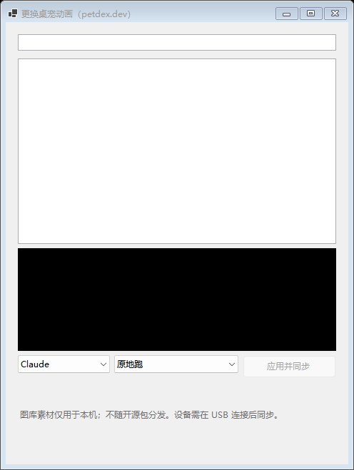

**更换桌宠动画…（petdex）**提供名称搜索、角色选择和动作预览，再“应用并同步”。
此截图未访问图库，因此列表为空；不以第三方角色填充公开文档。
“恢复默认动画”菜单恢复的是**已导入的本机角色默认资源**，不是强制清空自选素材；
如果本机没有该资源，程序保留当前选择并提示。首次启动的内置回退与这个恢复菜单是不同机制。

## 6. 等待输入与完成提醒

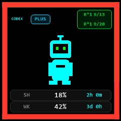
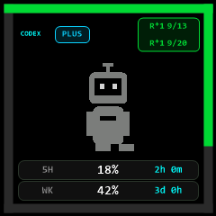

需要输入时有红色边缘提示；完成事件可触发提示音和完成状态，使用
**桥接服务 → 确认任务完成提醒**确认。截图只能展示一个静态帧，不能证明提示音或动画节奏。
Codex 完成提示依赖明确的主任务事件，启动不重放历史，子任务和重复事件不重复提示。
本机今日 Token 只覆盖能读取到的本地日志，不是账号所有设备的总用量。

## 7. 轮播、屏保与离线时钟

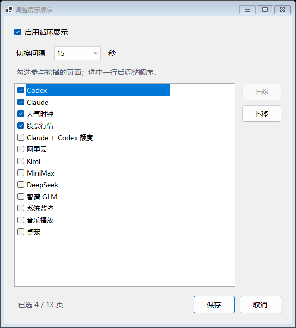

1. 右键 → **循环展示 → 调整展示顺序…**。
2. 勾选想展示的页面；选中一行后用“上移/下移”调整顺序。
3. 选择 10/15/30/60 秒间隔，保存；再选择 **显示模式 → 智能跟随**。
4. 手动固定页面会优先于轮播；需要恢复自动切页时重新选智能跟随。

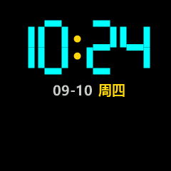

屏保可设置空闲触发时间，AI 工作和音乐事件可临时唤醒。设备仍有电、电脑状态失联时可显示 `PC OFF` 独立时钟；
这属于固件离线状态，不用电脑镜像截图冒充实机画面。Wi-Fi 回退需要配网及可达的局域网。

## 8. 镜像、亮度与设备管理

| 镜像快捷面板 | 设备控制 |
| --- | --- |
|  |  |

左键托盘看镜像，常用模式按钮切页；亮度滑块需设备连接才会生效。
设备连接 → 设备控制… 提供模式和亮度控制。
**设备信息、Wi-Fi 回退测试、Wi-Fi 重置**位于设备连接 → USB 管理与诊断。
重置需要用户确认，不属于普通安装步骤。诊断过程保留供电，详情见[刷机教程](FLASH.zh.md)。

## 9. Codex 额度趋势

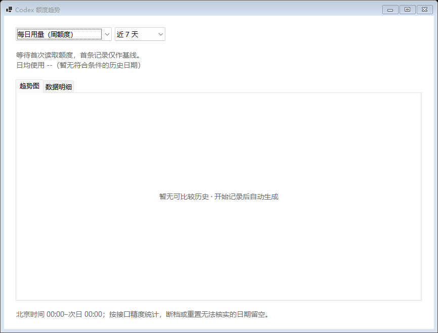

入口：模型额度 → Codex 额度趋势…，或镜像底部按钮。
可选择近 7/30 天、每日用量或五小时快照，切换趋势图/数据明细。
首次运行没有历史，首条数据只是基线，不会自动补齐过去日期。
历史保留 90 天；每日用量要求北京时间零点边界、账号和重置可核实；今天“统计中”，不完整日期 `--`。
两分钟采样未必能取得准确边界，可能长期没有完整日数据。[完整统计边界](QUOTA_TRENDS.md)。

## 10. 平台与验收限制

| 平台 | 本文能证明什么 | 不能据此认定什么 |
| --- | --- | --- |
| Windows | 当前源码能构建；离线界面和公开隔离回归可运行 | 所有真实账号、播放器、全新电脑安装及长期运行都通过 |
| ESP8266 | 配套源码可构建；已有历史分项 USB 验证 | 本次默认桌宠修改已刷到你的设备、所有页面实机一致、完整 Wi-Fi 回退通过 |
| macOS | 有菜单栏、镜像及配套源码；默认桌宠回退也在源码中 | 本机 Windows 不能验证 Mac 构建；当前 Mac CI 仍有构建问题，无真实 Mac 图集 |

这些图片是**功能说明材料**，不以 Windows 镜像代替 Mac 或实体屏验证。
[来源与复现](SCREENSHOTS.md) · [完整功能对齐矩阵](FUNCTIONAL_PARITY.md) · [发布准备状态](RELEASE_READINESS.md)
