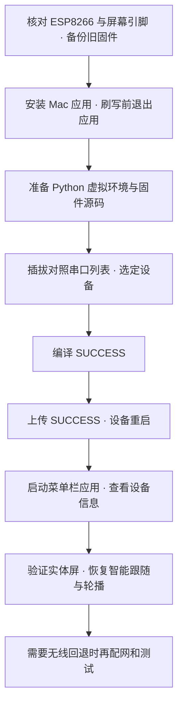

# Mac 安装与 ESP8266 刷机指南

[返回首页](../README.md) · [Mac 应用安装](MAC_PACKAGE.md) · [Windows 刷机](FLASH.zh.md) · [功能图鉴](FEATURES.zh.md)

本指南面向 macOS 13+、Apple Silicon（M 系列）的 AI-bot 测试版用户。Mac 应用已通过云端构建与打包检查；下面的安装、刷写和设备验收步骤仍待真实 Mac 验证，Intel 不在当前候选验收范围内。

## 操作路线



这是操作流程示意，不是实机截图或成功记录。应用安装在电脑上，固件写入小屏；两者需要分别完成。若设备已经运行兼容的 AI-bot 固件，可先验证连接，无须每次安装应用都重新刷机。

## 1. 安装应用，核对硬件

按 [Mac 应用安装](MAC_PACKAGE.md)下载测试版、核对 SHA-256、解压并拖入“应用程序”。它是菜单栏应用，启动后从屏幕顶部菜单访问功能，没有普通主窗口。当前包仅为临时签名，系统拦截的处理边界见安装页。

刷写对象必须是 **ESP8266 / ESP-12S，240×240 ST7789，SD2 小电视引脚方案**。对照[引脚表](FLASH.zh.md#1-核对硬件并留好回退材料)与 [platformio.ini](../firmware/platformio.ini)，不能只凭外观选择固件。准备可传输数据的 USB 线；USB-C 转接器也要支持数据传输。

保留旧固件、恢复步骤及用户设置备份；本项目分发包不含你的设备备份。下面上传命令会替换设备程序，不包含整片擦除，也不主动重置 Wi-Fi。刷写前从 AI-bot 菜单选择“退出”，并关闭串口监视器和其他占用该设备的程序。

## 2. 准备源码与工具

打开“终端”，确认已有 Python 3 和 Git：

```bash
python3 --version
git --version
```

缺少 Python 时从 [Python 官方 macOS 下载页](https://www.python.org/downloads/macos/)安装 Python 3；Git 若提示安装 Apple 命令行工具，按系统提示完成后重试。这里使用项目虚拟环境，不向系统 Python 安装包。

**源码路线：** 已有完整 AI-bot 源码时，在终端进入该目录；还没有源码时执行：

```bash
git clone https://github.com/yaoyouzhong/AI-bot.git
cd AI-bot
```

后续命令以包含 `firmware/platformio.ini` 的仓库根目录为起点。使用候选包时应保留对应源码版本，避免将不同版本的应用与固件混用。首次安装 PlatformIO 和编译可能下载平台、库及编译工具；这是本机编译依赖，不是重复下载 Mac 应用。

```bash
python3 -m venv .venv-flash
.venv-flash/bin/python -m pip install platformio==6.1.18
.venv-flash/bin/python -m platformio --version
```

看到 PlatformIO Core 6.1.18 后继续。无需 `sudo pip` 或激活虚拟环境。若下载失败，先解决网络或 Python 环境问题，不继续上传。

## 3. 找到小屏串口

先不插设备，运行一次；插入设备后再运行一次，对照新增端口及设备描述：

```bash
.venv-flash/bin/python -m platformio device list
```

Mac 使用 `/dev/cu.…`，不使用 Windows 的 `COM5`。常见名称包括 `/dev/cu.wchusbserial…`、`/dev/cu.usbserial…`；实际后缀随设备变化。应用还识别 `cu.SLAB_USBtoUART` 和 `cu.usbmodem` 前缀，端口被列出仍不等于 AI-bot 握手成功。

将下面示例替换为刚才识别出的**完整实际端口**，在同一终端中保存变量：

```bash
FLASH_PORT='/dev/cu.wchusbserialXXXX'
test -c "$FLASH_PORT" && printf '串口存在，继续核对设备型号。\n'
lsof "$FLASH_PORT"
```

未出现“串口存在”时停止，重新核对端口。`lsof` 若列出占用进程，正常退出对应应用后重试；无输出通常表示未发现占用。重新插拔后应重新检查端口，不盲用旧值。

**没有串口时：** 先换数据线、直连端口或转接器，并在“系统信息 → 硬件 → USB”查看设备。USB 设备出现但没有串口，再按芯片型号检查驱动。已经能正常识别时无须重复安装驱动。CH340/CH34x 使用 [WCH 官方驱动与图解](https://github.com/WCHSoftGroup/ch34xser_macos)，按其对应系统版本说明选择安装包和完成授权；其他芯片使用各自厂商驱动。不要套用旧版教程关闭系统保护，也不要以 `chmod 777` 代替故障排查。

## 4. 编译，再上传

仍在源码根目录，先只编译：

```bash
.venv-flash/bin/python -m platformio run -d firmware
```

确认目标 `nodemcuv2` 为 `SUCCESS`。输出固件位于 `firmware/.pio/build/nodemcuv2/firmware.bin`。编译失败时不要继续。

确认串口仍属于目标小屏、应用已经退出后上传：

```bash
.venv-flash/bin/python -m platformio run -d firmware -t upload --upload-port "$FLASH_PORT"
```

等待上传完成并显示 `SUCCESS`，设备重启后再启动应用。上传期间保持供电，不拔线。桥接通信速率是 `460800`；本教程让 PlatformIO 使用板卡配置决定上传参数，不把桥接速率强行当作刷写速率。

### 如果使用的是固件材料 ZIP

这是上面源码路线的替代方式。先校验下载 ZIP 的同名 `.sha256`，解压完整材料包；在包含 `source/firmware/rebuild.ini` 和 `source/vendor` 的**材料包根目录**打开终端。不要只提取 BIN，也不要删掉 vendor。

```bash
python3 -m venv .venv-flash
.venv-flash/bin/python -m pip install platformio==6.1.18
.venv-flash/bin/python -m platformio device list
```

按第 3 步核对端口，再设置实际路径并编译：

```bash
FLASH_PORT='/dev/cu.wchusbserialXXXX'
FLASH_PYTHON="$PWD/.venv-flash/bin/python"
cd source/firmware
"$FLASH_PYTHON" -m platformio run --project-conf rebuild.ini
```

只有编译 `SUCCESS`、确认端口无误且应用已退出后才上传：

```bash
"$FLASH_PYTHON" -m platformio run --project-conf rebuild.ini -t upload --upload-port "$FLASH_PORT"
```

此路线上传的是包内源码重建结果，并非直接刷写包顶层的 BIN。依赖、许可及联网要求见[固件材料说明](FIRMWARE_PACKAGE.md)。

## 5. 首次连接与实体屏验证

保持 USB 连接，从“应用程序”启动 `AIBotBridge.app`，在顶部菜单依次检查：

| 菜单操作 | 应观察到什么 |
| --- | --- |
| 查看本机状态 | USB 显示实际串口，而不是“未连接” |
| 查看设备信息… | 返回设备、协议、USB、桥接和页面等信息；仅有串口名称不足以确认连接 |
| 显示页面 → 系统监控 | 实体小屏切换到系统页面；以实体显示为准 |
| 显示页面 → 桌宠 | 无自定义资源时可显示内置 BYTE SPROUT，无须先导入桌宠 |
| 设备镜像 | 镜像可打开；镜像正常不能替代实体屏验证 |

USB 直连基础使用不要求先配置 Wi-Fi。上传成功后若仍无法取得设备信息，检查是否刷到了正确端口、是否仍有程序占用串口，以及应用与固件版本是否匹配。

测试完进入“轮播页面设置…”，保留原有页面选择与间隔，勾选“启用循环展示”并保存；保存会恢复 `auto` 智能跟随。已有自定义页面顺序时不要为测试重排。观察实体屏恢复正常轮播，不把最后的测试页留作默认。

## 6. 可选：Wi-Fi 配网与回退

需要无线回退时，电脑和设备须处于可以相互访问的局域网。未保存 Wi-Fi 的设备在启动后没有有效 USB 心跳时，约 15 秒进入 `AI-bot-Setup` 配网热点；操作细节见[刷机指南的 Wi-Fi 配网说明](FLASH.zh.md)。先退出桥接、保持供电，必要时重新上电等待热点；连接后按配网页设置 Wi-Fi，再让 Mac 回到正常网络。

启动应用完成 USB 握手后，配对令牌和 LAN 地址会下发；也可使用“重新下发 Wi-Fi 回退配置”。令牌保存在 Keychain，不需要把它复制到教程、截图或日志中。“重置设备 Wi-Fi…”会清除已保存网络并重启，只在确实需要重新配网时使用。

选择“测试 Wi-Fi 回退（保持 USB 供电）…”，保持线缆连接。应用会暂停常规 USB 发送约 12 秒、保持 LAN 服务运行，再恢复 USB，并以设备计数确认结果。只有显示“Wi-Fi 回退与 USB 恢复均已由设备计数确认”才能记录为通过。网络隔离、地址或防火墙问题可能使测试失败；不要直接归因于固件，更不要关闭防火墙作为常规步骤。

## 常见问题

| 现象 | 下一步 |
| --- | --- |
| `python3: command not found` | 安装 Python 3，重新打开终端，再核对版本 |
| 找不到 `firmware` 或 `rebuild.ini` | 检查当前目录；仓库路线与材料包路线不可混用 |
| `could not open port` / `Resource busy` | 重新枚举实际端口，退出桥接和串口监视器，用 `lsof` 查看占用 |
| 一直停在 `Connecting...` | 检查数据线、供电及板卡自动下载电路；按板卡厂商说明进入下载模式，不尝试未知引脚短接 |
| 上传成功但黑屏或花屏 | 核对 ESP8266 型号、ST7789 驱动与 SD2 引脚，编译成功不证明屏幕接线正确 |
| 菜单显示 USB，但设备信息没有返回 | 检查固件协议和版本、目标串口以及占用；尚不能认定握手完成 |
| 退出应用后出现 `PC OFF` | 设备仍有供电而桥接离线时的独立时钟状态；重启应用再确认连接恢复 |

反馈时记录 Mac 型号、macOS 版本、应用 ZIP 的 SHA-256、固件源码版本、端口类型，以及编译/上传/设备验证分别是否通过；分享日志前移除令牌和私人网络信息。

命令参数依据 [PlatformIO run 文档](https://docs.platformio.org/en/latest/core/userguide/cmd_run.html)与[串口枚举文档](https://docs.platformio.org/en/latest/core/userguide/device/cmd_list.html)。

## English summary

This guide covers the Apple Silicon Mac test build: install the menu-bar app, verify the ESP8266/ST7789 pin layout, create a Python virtual environment, identify the actual `/dev/cu.…` port, build and upload with PlatformIO, then verify the physical display and USB handshake. An alternative route rebuilds the complete firmware-materials archive using `rebuild.ini`. Restore automatic cycling after checks; Wi-Fi fallback is optional and requires device-confirmed results. These instructions are not a claim of real-Mac or device acceptance.
