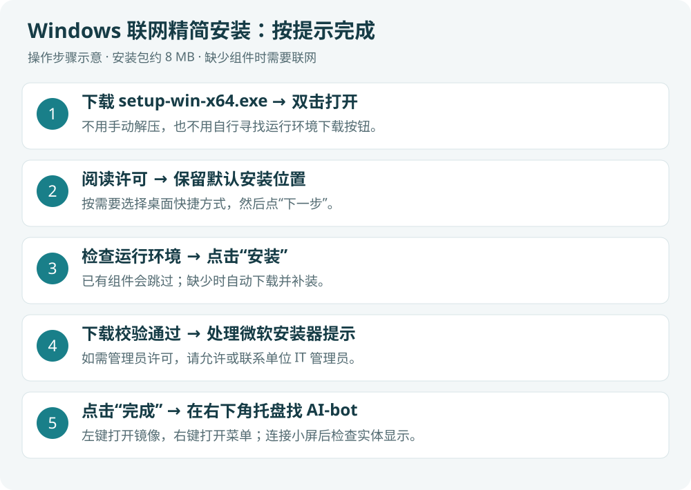
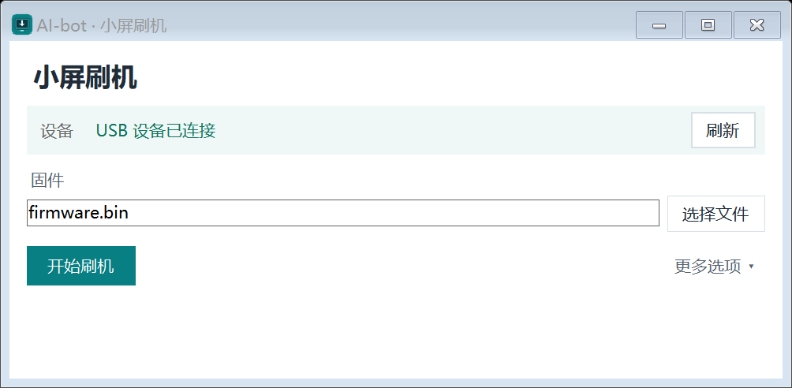
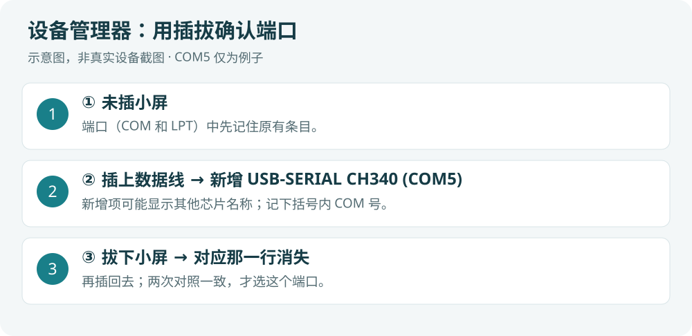
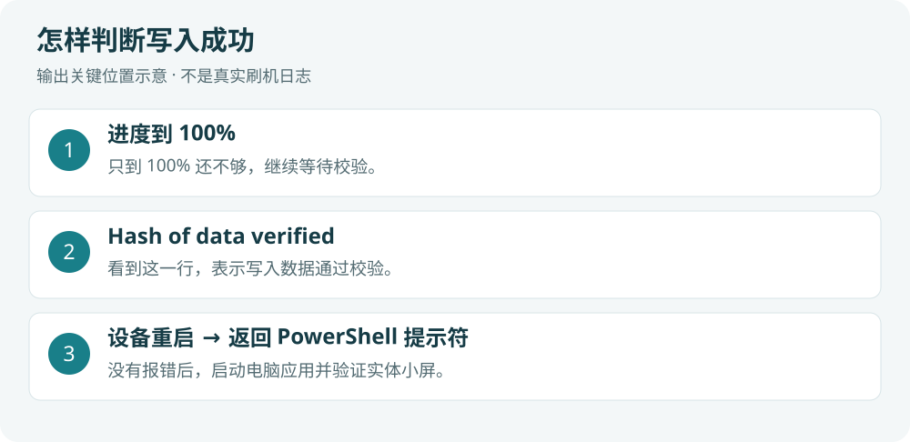

# AI-bot 完整安装图文指南

**从下载到小屏正常显示，只看这一页。** 适用 v0.2.2 测试版，更新于 2026-09-21。

**Windows 路线：准备设备 → 下载两个包 → 安装电脑程序 → 给小屏刷固件 → USB 连接验收 → 设置自己的内容。**

- **Windows 10/11 x64**：按下面第 1～6 步做。
- **Mac（macOS 13+、M 系列）**：先看第 1、2 步，再看本页的 [Mac 完整操作](#mac)。
- **只用电脑镜像，没有小屏**：跳过第 1、4、5 步，安装后直接设置内容。
- **已经装过 AI-bot**：看本页 [升级与卸载](#upgrade)。v0.2.2 的设备切页修复需要同时更新电脑程序和固件。

图片中的流程图是操作示意；应用截图使用离线样例。实际结果以自己的设备响应和实体屏为准。

<a id="prepare"></a>
## 1. 准备好设备和数据线

| 准备项 | 要求 |
| --- | --- |
| 电脑 | Windows 10/11 x64，或 macOS 13+ 的 M 系列 Mac；下载安装包时保持联网，图形刷机无需额外下载工具 |
| 小屏 | **ESP8266 / ESP-12S + 240×240 ST7789 + SD2 小电视引脚方案** |
| USB 线 | 能传输数据，不能是仅充电线 |
| 旧固件 | 有厂商恢复包就留好；没有则在第 4 步先备份 |

外观相似的小电视可能使用不同芯片。**ESP32 或型号不清楚的设备不要直接刷本固件，先向卖家核对。** USB 直连不需要先配置 Wi-Fi。

<details>
<summary>自接线或需要与卖家核对：展开引脚表</summary>

| 屏幕信号 | GPIO | NodeMCU 常见丝印 |
| --- | ---: | --- |
| MOSI / SDA | 13 | D7 |
| SCLK / SCL | 14 | D5 |
| CS | 15 | D8 |
| DC | 0 | D3 |
| RST | 2 | D4 |
| BL | 5，低电平点亮 | D1 |

D7 不是 GPIO7。此表只列信号，不用于推断供电接法。

</details>

<a id="download"></a>
## 2. 下载对应电脑的应用包，再下载固件包

**Windows 配小屏，只下载下表第 1、3 项。** Mac 配小屏下载第 2、3 项。版本要一致。

| 用途 | 点击下载 | 下载后怎样处理 |
| --- | --- | --- |
| 1. Windows 应用 | [AIBotBridge-0.2.2-setup-win-x64.exe](https://github.com/yaoyouzhong/AI-bot/releases/download/v0.2.2/AIBotBridge-0.2.2-setup-win-x64.exe) | 约 8 MB，双击安装 |
| 2. Mac 应用 | [AIBotBridge-0.2.2-local-candidate-macos-arm64.zip](https://github.com/yaoyouzhong/AI-bot/releases/download/v0.2.2/AIBotBridge-0.2.2-local-candidate-macos-arm64.zip) | 解压后把 App 放入“应用程序” |
| 3. 小屏固件 | [AI-bot-0.2.2-firmware-materials.zip](https://github.com/yaoyouzhong/AI-bot/releases/download/v0.2.2/AI-bot-0.2.2-firmware-materials.zip) | 新版刷机窗口直接选 ZIP；旧版手动刷写则解压 |

[全部附件与校验文件](https://github.com/yaoyouzhong/AI-bot/releases/tag/v0.2.2)中，`source.zip` 是源码，普通安装不用下载；`.sha256` 是校验文件，不能双击安装。固件材料包约 30 MB，但只把里面的 `firmware.bin` 写入小屏。

**完成标志：电脑应用包与固件 ZIP 已下载。新版图形工具不需要解压固件包。**

<a id="windows"></a>
## 3. 安装 Windows 程序

1. 双击第 2 步的 **setup-win-x64.exe**，点击“下一步”。
2. 阅读并接受许可，安装位置保留默认值，按需要创建桌面快捷方式。
3. 到“检查运行环境”页面后点击“安装”。已有组件自动跳过，缺少的 .NET 8 桌面运行时和 WebView2 会自动补装；保持联网，按提示处理微软安装器的管理员许可。
4. 显示安装完成后，保留“启动 AI-bot”，点击“完成”。
5. 在右下角托盘找 AI-bot；没看到时点 **向上的小箭头**展开隐藏图标。**左键打开镜像，右键打开菜单。没有大窗口是正常的。**



**完成标志：托盘有 AI-bot，左键能打开电脑镜像。** 若微软安装器要求重启，先重启再从开始菜单打开 AI-bot。

安装包目前未签名。若系统拦截，先核对是否来自本项目发布页及下载校验值；单位电脑按 IT 管理规定处理，不需要关闭系统防护。安装失败时按提示处理后重试，不继续把未完成安装当作成功。

<a id="flash"></a>
## 4. 给小屏刷入固件（首次使用或更新设备时做）

**只有电脑程序和设备固件都更新，v0.2.2 的手动切页修复才完整生效。** 设备已装同版固件可直接进入第 5 步。

### 4.1 打开“小屏刷机”窗口

保持小屏通过 USB 数据线连接。右键 AI-bot 托盘 → **设备连接 → 小屏刷机…**。不用手动退出桥接，工具会在需要时自动释放串口，并在结束后恢复桥接。

> **版本提示：图形刷机是尚未发布的新功能，当前公开 v0.2.2 安装包没有这个菜单。** 使用包含此功能的新版桥接；旧版用户在新版发布前可展开本页底部的“旧版兼容刷写”。不要把未发布功能当作现有下载包已经具备。



### 4.2 连接小屏，选择固件

1. 插入小屏。只有一台 USB 串口设备时会自动选中；通过桥接连接的小屏优先识别。只有多台设备无法区分时才需拔插一次小屏，**不用选择 COM 号**。
2. 点击 **选择文件**，选第 2 步下载的 **firmware-materials.zip**，无需解压；已有 `firmware.bin` 也可以直接选。
3. 点击 **开始刷机**。设备型号要求见第 1 步，工具会自动检查芯片。

一直提示“请插入小屏”时，先换数据线和 USB 插口。确认设备使用 CH340 且缺驱动后，再安装 [WCH 官方驱动](https://www.wch.cn/downloads/CH341SER_EXE.html)。同时关闭其他串口软件。

### 4.3 等待“刷机完成”

工具会依次完成：**准备官方工具 → 检查固件和芯片 → 完整备份 → 写入 → 回读校验**。安装包已包含刷机工具，刷机时无需联网下载；不用安装 Python、输入命令或填写刷写地址。

备份时小屏可能暂时黑屏，请保持 USB 连接。百分比每秒最多刷新一次；读取停滞时会自动降速重试。

- **备份失败或文件不完整时不会继续写入。** 展开“更多选项”后，“只备份设备”可单独保存原固件，“查看备份”可以找到备份及校验文件。
- Windows 在准备、备份阶段可以取消；写入与校验开始后保持供电，等待结束。备份可能包含网络配置，请勿公开上传。
- 写入或校验失败会保留错误提示和记录，不会显示成功。检查连接后可重新开始，不要全片擦除。

**完成标志：窗口显示“刷机完成，小屏正在重新连接”。** 工具会重新启动刷机前正在运行的原桥接程序，恢复智能跟随和循环展示，保留原有页面、顺序及间隔；若刷机前没有运行桥接，按提示从开始菜单启动 AI-bot。接着按第 5 步检查实体屏。

<a id="connect"></a>
## 5. 启动桥接，确认实体屏真的连上了

1. 保持 USB 数据线连接，关闭刷机窗口，从开始菜单启动 **AI-bot**。
2. 右键托盘 → **设备连接 → USB 管理与诊断 → 设备信息…**，确认设备有响应、USB 与桥接在线。
3. 右键托盘 → **显示模式 → 系统监控**，实体屏应显示并更新 CPU、内存等数据。
4. 再选 **股票行情**或**天气时钟**，确认实体屏能切换。手动选页后不会被 AI 完成提醒抢走。
5. 日常需要轮播时，选 **显示模式 → 智能跟随**，再勾选 **循环展示 → 启用循环展示**；在“调整展示顺序…”中选择页面和间隔。


*上图为托盘菜单。设备信息入口在“设备连接”，切页入口在“显示模式”。首次连接可能还在同步文字和动画资源，等同步结束再判断是否缺图。*

**到这里安装完成：设备信息有响应 + 实体屏有内容 + 手动切页正常。电脑镜像有图，不能代替实体屏验收。**

<a id="settings"></a>
## 6. 设置自己的内容

基础连接成功后，只配置自己要用的功能，不需要一次填完所有项目。

| 想设置什么 | Windows 托盘右键入口 | 怎么做 |
| --- | --- | --- |
| 天气 | 内容设置 → 设置天气 → 数据源与定位… | 设置所在城市或定位，保存后打开天气页查看 |
| 股票 | 内容设置 → 设置自选股… | 输入市场前缀及代码，例如 `sh000001,hk00700,usAAPL`，保存后查看股票页 |
| Claude / Codex | 先在本机对应工具完成登录，再选桥接服务 → 刷新状态 | 首次没有使用记录或额度时可能显示等待；不需要把密码填入普通设置 |
| 国产模型 | 模型额度 → 国产模型额度设置… | 左侧选自己使用的厂商，按页面要求保存并测试或网页登录；未使用的厂商留空 |
| 开机启动 | 桥接服务 → 开机启动 | 按需要勾选；安装器不会自动启用 |
| 固定显示一页 | 显示模式 → 对应页面 | 固定选择会停止轮播；要轮播则重新启用循环展示 |


*接口型厂商按页面填写 API Key 等资料后点“保存并测试”；网页登录型厂商在内置页面完成登录后检查结果。网页打开不代表额度已经读到，要看到成功状态与数据。只开通普通 API 的账户不能当成订阅套餐。*

<a id="mac"></a>
## Mac 完整操作（M 系列，macOS 13+）

此分支把安装、刷机和连接都写在下面，不需要再找其他 Mac 教程。Intel Mac 不在当前发布范围；新版图形刷机功能已通过 Mac CI 测试和构建；首次启动、权限及硬件交互仍需实机验证。

### M1. 安装菜单栏应用

下载第 2 步的 Mac ZIP，解压后把 `AIBotBridge.app` 拖到 **应用程序**，从 Finder 打开。它显示在屏幕顶部菜单栏，没有普通主窗口。

应用尚未经过 Apple 公证。如果提示无法验证开发者，只有确认来自本项目且文件校验无误时，才按 Apple 的标准方式：先尝试打开一次，再到 **系统设置 → 隐私与安全性 → 仍要打开**，确认打开。若提示“将损坏电脑”或文件已损坏，停止并重新核对来源，不移除系统防护。[Apple 官方说明](https://support.apple.com/zh-cn/102445)

### M2. 在界面里刷入固件

新版菜单栏 **AI-bot → 小屏刷机…**，操作顺序与 Windows 相同：

1. 连接 USB。应用自动识别已连接的小屏；多台设备无法区分时，按提示拔插一次小屏，不需要选择设备端口。
2. 点 **选择文件**，选择第 2 步下载的固件 ZIP，或已有 `firmware.bin`。
3. 点 **开始刷机**。安装包已包含 Apple Silicon 刷机工具，不需要 Python、Git 或 PlatformIO。
4. 等到窗口显示 **刷机完成，小屏正在重新连接**。应用自动恢复 USB 连接与智能跟随、循环展示，原页面顺序和间隔不变。

操作中不要退出应用或断开供电；Mac 窗口会阻止操作期间关闭。备份失败则停止，原固件不会被写入覆盖；展开“更多”→“查看备份”可找到备份。

此入口同样属于尚未发布的新功能，公开 v0.2.2 没有此菜单。Mac 界面为原生窗口，Windows 图示仅用于说明操作顺序；Mac CI 测试与构建已通过，设备实测仍待完成。

无串口时先检查数据线和转接器；确认 CH340 缺驱动时使用 [WCH 官方 Mac 驱动](https://github.com/WCHSoftGroup/ch34xser_macos)。

### M3. 连接和开始使用

1. 保持 USB 连接，重新打开 `AIBotBridge.app`。
2. 顶部菜单点 **查看设备信息…**，确认设备响应；“查看本机状态”可查看串口连接。
3. **显示页面 → 系统监控**，再切到 **股票**，检查实体屏。
4. 打开 **轮播页面设置…**，按需要勾选启用循环展示，保留自己的页面与顺序。
5. 音乐功能按系统提示授权访问正在运行的 Music 或 Spotify；不使用则不必配置。其他内容在菜单对应设置中填写。

**完成标志仍是设备响应和实体屏切页，不是只有电脑镜像打开。**

<a id="optional"></a>
## 可选：需要时再做

<details>
<summary>Wi-Fi 无线回退：USB 已经正常后再配置</summary>

1. 退出桥接，保持小屏 USB 供电。设备没有可用 Wi-Fi 且没有 USB 心跳时，启动约 15 秒后可出现 `AI-bot-Setup` 热点。
2. 手机或电脑连接该热点，按弹出的配网页选择自己的 2.4GHz Wi-Fi 并输入密码；不弹出时，在浏览器打开此热点连接的网关地址。
3. 电脑回到正常网络，启动桥接并先用 USB 连好一次，让桥接自动下发回退配置。
4. 电脑与设备处于可互通的局域网。在 Windows 的“设备连接 → USB 管理与诊断”或 Mac 顶部菜单，选“测试 Wi-Fi 回退（保持 USB 供电）…”。
5. 查看测试结果，测试结束后恢复正常 USB 连接。不要拔掉唯一电源线。若网络有客户端隔离，联系网络管理员处理；USB 仍可正常使用。

“重置设备 Wi-Fi”不是普通安装步骤，仅在确实需要更换或清除设备网络时使用。

</details>

<details>
<summary>Windows 手动 ZIP：不使用 EXE 安装器时</summary>

1. 从本版发布页下载 `AIBotBridge-0.2.2-local-candidate-win-x64.zip`。
2. 安装 [微软 .NET 8 Desktop Runtime](https://dotnet.microsoft.com/zh-cn/download/dotnet/8.0)：选择 **.NET 桌面运行时 → Windows x64**，不是 SDK、ASP.NET、x86 或 Arm64。已装兼容 8.0.x 桌面运行时则跳过。
3. 需要国产模型网页登录且本机缺少组件时，从 [微软 WebView2 官方下载页](https://developer.microsoft.com/microsoft-edge/webview2/)安装 Evergreen Runtime。
4. 右键 ZIP → 全部解压到固定文件夹。打开其中 `AIBotBridge.exe`，不要只复制一个 EXE，也不要在 ZIP 内直接运行。
5. 回到本页第 4～6 步完成固件、连接和内容设置。

</details>

<details>
<summary>检查下载是否完整（SHA-256）</summary>

从同一发布页下载同名 `.sha256` 文件，与原文件放在一起。Windows 在下载目录打开 PowerShell，例如校验固件包：

```powershell
Get-FileHash -Algorithm SHA256 .\AI-bot-0.2.2-firmware-materials.zip
Get-Content .\AI-bot-0.2.2-firmware-materials.zip.sha256
```

两串哈希相同才使用，忽略字母大小写。校验 EXE 或其他 ZIP 时，把上面的文件名改成实际文件名。

Mac 在下载目录打开终端，例如：

```bash
shasum -a 256 -c AIBotBridge-0.2.2-local-candidate-macos-arm64.zip.sha256
```

应输出 `OK`。校验完整性不等于项目数字签名。

</details>

<details>
<summary>旧版兼容刷写：仅供尚无“小屏刷机”菜单的公开 v0.2.2 使用</summary>

新版图形工具发布后，普通安装直接按上面的界面步骤操作。以下保留旧版的完整兼容方法，无需跳到其他教程。

#### Windows 旧版

### 4.1 退出桥接，找出小屏的端口

右键 AI-bot 托盘 → **退出**，同时关闭刷机软件、串口监视器等占用串口的程序。接好 USB 数据线。

打开 Windows **设备管理器 → 端口（COM 和 LPT）**，拔下、再插上小屏，记住随设备出现的 COM 号。图中 `COM5` 只是示例，以自己的电脑为准。



没有“端口”或插拔无变化时，先换数据线和 USB 插口。确认设备使用 CH340 且缺驱动后，再安装 [WCH 官方驱动](https://www.wch.cn/downloads/CH341SER_EXE.html)。

### 4.2 准备刷机工具

首次刷机需要 Python。已有能运行的 Python 可跳过安装；没有则下载 [Python 3.12 Windows 64 位安装器](https://www.python.org/downloads/release/python-31210/)，在页面的 Files 表选择 **Windows installer (64-bit)**，安装时勾选 **Add python.exe to PATH**。

进入第 2 步**包含 firmware.bin 的解压文件夹**，点击资源管理器地址栏，输入 `powershell` 并回车。下面命令在这个窗口逐行执行，报错时先处理再继续：

```powershell
python --version
python -m venv .venv-flash
.\.venv-flash\Scripts\python.exe -m pip install esptool==4.8.1
.\.venv-flash\Scripts\python.exe -m esptool version
$flashPort = Read-Host '请输入小屏的实际 COM 号，例如 COM5'
.\.venv-flash\Scripts\python.exe -m esptool --chip esp8266 --port $flashPort flash_id
```

**完成标志：工具显示 4.8.1，识别到 ESP8266 和 Flash 容量。** 如果 `python` 打开商店或找不到，安装 Python 后重新打开此 PowerShell 窗口。

### 4.3 先备份，再写入

仍在**同一个目录、同一个 PowerShell 窗口**，先备份原设备：

```powershell
$backupFile = 'backup-before-ai-bot-' + (Get-Date -Format 'yyyyMMdd-HHmmss') + '.bin'
.\.venv-flash\Scripts\python.exe -m esptool --chip esp8266 --port $flashPort --baud 115200 read_flash 0 ALL $backupFile
```

读取成功后，把备份留在安全位置；它可能包含私人网络配置，不要公开上传。备份失败就先停止。

确认备份成功、桥接已退出，然后执行：

```powershell
.\.venv-flash\Scripts\python.exe -m esptool --chip esp8266 --port $flashPort --baud 115200 write_flash 0x0 .\firmware.bin
```

写入期间保持供电，不拔线。此命令只更新本项目固件，没有全片擦除；`0x0` 是本项目 ESP8266 固件地址，115200 是刷写速度，不是桥接通信速度。



**完成标志：写入到 100%，出现 `Hash of data verified`，设备重启并返回命令提示符。** 只看到 `Connecting...` 或出现报错，不算成功。

#### Mac 旧版

### M2. 刷入同一份现成固件

设备型号、引脚要求与第 1 步相同。完整解压第 2 步的固件 ZIP，先退出 AI-bot 菜单栏应用。

打开“终端”，输入 `cd `（后面有空格），把**含 firmware.bin 的文件夹**拖进去，再按回车。已有 Python 3 可复用；没有则从 [Python 官方 Mac 下载页](https://www.python.org/downloads/macos/)安装后重新打开终端。

```bash
python3 --version
python3 -m venv .venv-flash
.venv-flash/bin/python -m pip install esptool==4.8.1
.venv-flash/bin/python -m esptool version
.venv-flash/bin/python -m serial.tools.list_ports
```

设备拔下和插入后各执行一次最后一条，找出新增的 `/dev/cu.…` 端口；它不是 Windows 的 COM 号。把下列第一行替换成**自己的完整端口**：

```bash
FLASH_PORT='/dev/cu.wchusbserialXXXX'
.venv-flash/bin/python -m esptool --chip esp8266 --port "$FLASH_PORT" flash_id
BACKUP_FILE="backup-before-ai-bot-$(date +%Y%m%d-%H%M%S).bin"
.venv-flash/bin/python -m esptool --chip esp8266 --port "$FLASH_PORT" --baud 115200 read_flash 0 ALL "$BACKUP_FILE"
```

确认识别为 ESP8266、备份成功后，在同一窗口写入：

```bash
.venv-flash/bin/python -m esptool --chip esp8266 --port "$FLASH_PORT" --baud 115200 write_flash 0x0 firmware.bin
```

出现 `Hash of data verified` 并重启才算完成。不用安装 Git、PlatformIO，也不用重新编译源码。备份只自己保留。无串口时先检查数据线和转接器；确认是 CH340 且缺驱动时使用 [WCH 官方 Mac 驱动](https://github.com/WCHSoftGroup/ch34xser_macos)。

</details>

<a id="upgrade"></a>
## 已安装用户：升级与卸载

**升级：退出旧桥接 → 安装新版或替换完整 App/ZIP → 按本页刷写新版固件 → 重新启动并验收实体屏。** 已完成 v0.2.2 设备更新的用户不用重复刷写。

Windows 从旧 ZIP 迁移或改变安装位置后，在新版托盘关闭、再开启一次“开机启动”来更新路径。原来的页面、顺序、间隔和授权资料通常会保留，不要清空 AppData。

Windows 卸载：先关闭托盘“开机启动”并退出程序，再到 **设置 → 应用 → AI-bot → 卸载**。用户配置和公共运行环境会保留。Mac 卸载：关闭登录启动项、退出应用，再从“应用程序”移除 App；这不会自动清除 Keychain 中的配对资料。

<a id="troubleshooting"></a>
## 卡在哪一步，就看这一行

| 现象 | 处理方法 |
| --- | --- |
| Windows 启动后没有大窗口 | 展开右下角隐藏托盘；左键 AI-bot 打开镜像 |
| 缺 .NET 或授权页空白 | 用 EXE 安装器补齐运行环境；手动 ZIP 按本页可选步骤装 Desktop Runtime/WebView2 |
| 提示安装文件缺失或校验失败 | 重新安装完整版；校验失败的工具不会执行，新固件不会写入 |
| 一直找不到小屏 | 换数据线/USB 插口/转接器，再按芯片型号检查驱动 |
| `Access denied`、串口打不开 | 从菜单退出 AI-bot，关闭其他串口工具，再核对端口 |
| 一直 `Connecting...` | 确认型号、端口和数据线；按板卡厂商方法进入下载模式，不猜引脚短接 |
| 找不到 `firmware.bin` | 进入固件材料包解压后的顶层，在该目录打开终端 |
| 写入失败、校验失败 | 保留报错，检查供电和连接后重试；不要全片擦除 |
| 写入成功但黑屏/花屏 | 核对 ESP8266、ST7789 和第 1 步引脚；外形相似不代表兼容 |
| 小屏显示 `PC OFF` | 启动桥接，用“设备信息”确认连接；这表示暂未收到有效电脑状态 |
| 镜像正常但小屏没反应 | 核对 USB 设备响应、串口占用以及是否刷了对应版本固件 |
| 手动切页仍被提醒覆盖 | 电脑与固件都要更新到 v0.2.2；只装新版电脑程序不够 |
| Mac 提示文件损坏或将损坏电脑 | 停止打开，重新核对来源与校验值；不要用移除隔离或关闭保护的命令 |

新版图形工具调用 SHA-256 固定的 Espressif esptool 4.9.1；旧版兼容命令使用 4.8.1。参数依据 [Espressif esptool v4 官方文档](https://docs.espressif.com/projects/esptool/en/release-v4/esp32/esptool/basic-commands.html)，写入地址来自本项目 ESP8266 配置。
