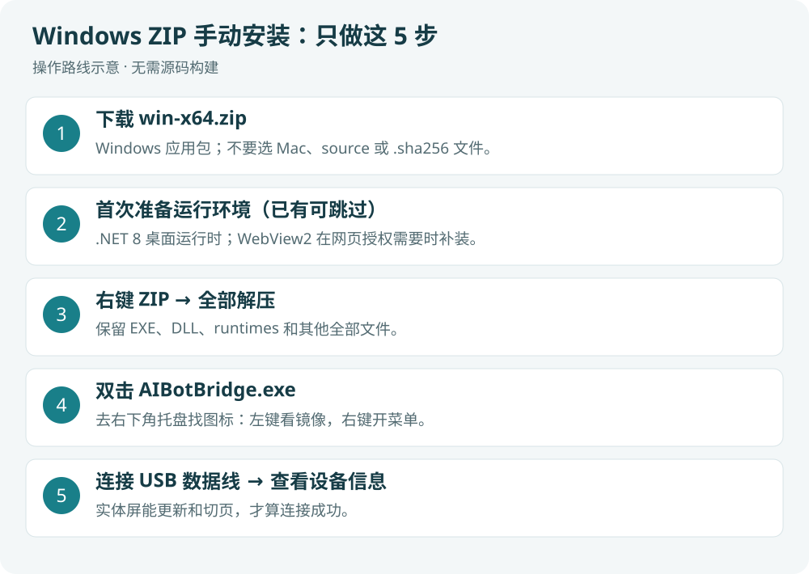
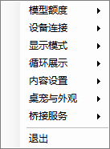
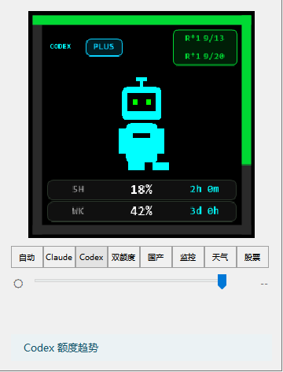
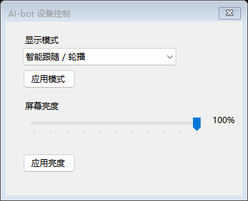
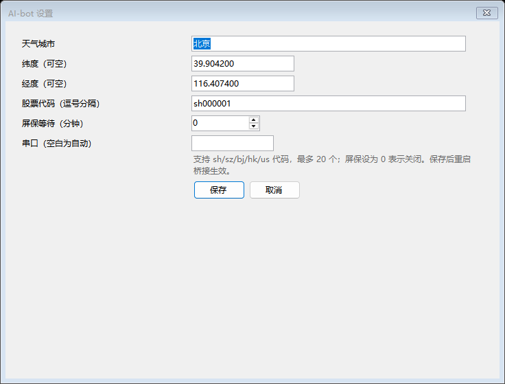

# Windows 安装与首次使用图解

[返回首页](../README.md) · [刷机图解](FLASH.zh.md) · [功能与界面图鉴](FEATURES.zh.md)

适用：Windows 10/11 x64，AI-bot `0.1.0` 开发基线。当前没有正式 Release，
本教程按“从源码构建本地候选包”展开。macOS 测试及 Release 编译已通过；Mac 使用独立的[候选安装说明](MAC_PACKAGE.md)，不能安装 Windows 包。



## 获取现成候选包（候选流水线验证后）

后续经批准运行 **Actions → Candidate packages**，成功后在运行页下载 `candidate-windows-firmware` 附件（Actions 下载需登录 GitHub）。选择 Windows ZIP；源码 ZIP 和固件材料 ZIP 不是 Windows 应用。正式发布后，普通用户从仓库 Releases 下载相同类型的附件，无需 Git、Python 或 SDK。

Windows 候选仍需要下表的 **.NET 8 Desktop Runtime x64** 和 **WebView2 Runtime**。核对 ZIP 同名 `.sha256`，完整解压到自己的应用目录后启动 `AIBotBridge.exe`；不要在压缩包内运行，也不要只复制 EXE。后续首次启动与配对按本教程继续。

目前新候选流水线尚未推送验证，仓库没有正式安装包下载；下方源码方式仍可使用。

## 1. 先准备什么

| 项目 | 去哪里获取 / 如何确认 |
| --- | --- |
| Git | [Git 官方 Windows 下载](https://git-scm.com/downloads/win)，安装后重开终端，运行 `git --version` |
| Python | [Python 官方 Windows 下载](https://www.python.org/downloads/windows/)，运行 `python --version` 和 `python -m pip --version`；本教程要求 `python` 能在终端调用 |
| .NET 8 SDK | [.NET 官方下载页](https://dotnet.microsoft.com/zh-cn/download/dotnet/8.0)，构建选 **SDK → Windows → x64**；运行 `dotnet --list-sdks` 应有 `8.0.4xx`（仓库固定使用这一 SDK 系列） |
| .NET 8 Desktop Runtime x64 | 同一官方页面的 **.NET Desktop Runtime → Windows → x64**；仅运行 ZIP 也需要桌面运行时，不能用 ASP.NET Runtime 替代 |
| WebView2 Runtime | [微软官方页面](https://developer.microsoft.com/microsoft-edge/webview2/)，选择 Evergreen Standalone Installer 的 x64；用于国产厂商网页授权 |
| 设备 | 已刷入配套 AI-bot 固件的 ESP8266 小屏及 USB **数据线**；还没刷机时先完成[刷机教程](FLASH.zh.md) |

安装 SDK 后可运行 `dotnet --list-runtimes`，确认包含 `Microsoft.WindowsDesktop.App 8.0.x`。
工具安装完成后重开 PowerShell；找不到 `python` 时先修复 Python 命令入口，不跳过脚本中的检查。

## 2. 获取源码并生成候选包

在你希望存放项目的目录打开 PowerShell，逐行运行：

```powershell
git clone https://github.com/yaoyouzhong/AI-bot.git
cd AI-bot
powershell -NoProfile -File scripts/package_windows_local.ps1
```

脚本会联网恢复 NuGet 依赖、在独立目录构建、运行公开隔离测试，然后生成 Windows ZIP、源码 ZIP、许可及校验文件。
等命令全部结束，确认没有红色错误；不要把中途生成的 EXE 当成最终包。

输出位于仓库 `artifacts/release-check-<随机标识>/`。可以用下面的只读命令找到 Windows ZIP：

```powershell
Get-ChildItem .\artifacts -Recurse -Filter 'AIBotBridge-*-local-candidate-win-x64.zip' |
    Sort-Object LastWriteTime -Descending |
    Select-Object -First 3 FullName, LastWriteTime
```

选择**本次成功构建**产生的包，核对文件时间。`AI-bot-*-source.zip` 是源码，不能双击运行；
`AI-bot-*-firmware-materials.zip` 是固件材料，不能当 Windows 程序启动。

本节生成 Windows 与源码包；固件可按刷机教程单独构建上传。开发者若使用打包脚本的 `-Firmware` 选项，须确保该脚本调用的 `python` 环境已安装 PlatformIO 6.1.18；刷机教程的独立虚拟环境不会自动应用到打包脚本。
公开仓库尚无现成的正式下载包；未来有 Release 后也应选择完整 Windows ZIP，不能下载单个 EXE 代替。

## 3. 校验并完整解压

ZIP 旁的 `.sha256` 记录 ZIP 哈希；使用实际路径替换示例路径：

```powershell
Get-FileHash -Algorithm SHA256 -LiteralPath 'C:\下载目录\AIBotBridge-0.1.0-local-candidate-win-x64.zip'
Get-Content -LiteralPath 'C:\下载目录\AIBotBridge-0.1.0-local-candidate-win-x64.zip.sha256'
```

两处 SHA-256 应一致。哈希用于检查文件完整性，不是数字签名。
右键 ZIP → 全部解压，选一个稳定目录，例如用户目录内的 `Apps\AI-bot`。不要在压缩包里直接运行。
程序目录必须保留 `AIBotBridge.exe`、DLL、`runtimes/`、`licenses/`、校验文件等全部内容。

## 4. 启动后去哪里找

1. 正常退出旧版桥接及其他 AI-bot 实例，避免争用 USB 串口和本机 `8765` 端口。
2. 从资源管理器双击解压目录中的 `AIBotBridge.exe`。
3. 它常驻**右下角系统托盘**，不会主动打开主窗口。看不到图标时先展开托盘的隐藏图标区域。
4. **左键图标**打开设备镜像，**右键图标**打开菜单。

| 右键功能菜单 | 左键设备镜像 |
| --- | --- |
|  |  |

图中额度为虚构样例。首次启动尚未登录账号时，额度显示 `--` 属正常情况。
默认自带 BYTE SPROUT，**不需要先下载或导入桌宠**；自选动画只用于换外观。

## 5. 接上设备并确认成功

1. 使用数据线连接已刷 AI-bot 固件的 ESP8266；电脑要能识别它的串口。
2. 默认自动找串口，无需先填 `COM7`。实际端口号见设备管理器，换电脑或 USB 接口可能变化。
3. 右键 → **设备连接**，查看连接摘要；再打开 **USB 管理与诊断 → 设备信息…**，应能读到设备信息。
4. 右键 → **显示模式 → 系统监控**，确认实体屏也切到该页，而不只是电脑镜像发生变化。
5. 再选择 **智能跟随**，保留或设置循环展示的页面、顺序及间隔。



基础 USB 连接不要求设备和电脑在同一 Wi-Fi。**镜像能打开，不等于设备已连接**；设备信息和实体屏切页才是下一步确认依据。
默认串口自动识别失败时，右键 → 设备连接 → 设置连接串口…，填入实际端口，保存后退出并重新启动桥接。

## 6. 首次内容配置

| 想配置什么 | 实际入口 | 做完看什么 |
| --- | --- | --- |
| 天气 | 内容设置 → 设置天气 → 数据源与定位… | 保存并刷新后，城市和温度符合预期；不提供和风 Key 时可使用 Open-Meteo 回退 |
| 股票 | 内容设置 → 设置自选股… | 逗号分隔代码，最多 20 个；例如 `sh000001,hk00700,usAAPL`；保存后重启桥接 |
| Claude/Codex 额度 | 先在本机对应 CLI 完成合法登录；桥接服务 → 刷新状态 | 模型额度菜单及对应显示页出现数据；账号无对应额度、授权失效时可能仍为 `--` |
| 国产额度 | 模型额度 → 国产模型额度授权… | 在窗口选支持采集的厂商，完成自己的登录并等额度刷新 |
| 自动切页 | 循环展示 → 调整展示顺序… | 勾选页面、上移/下移、选择间隔、保存；显示模式选智能跟随 |
| 自动屏保 | 显示模式 → 屏保 | 选择空闲分钟数，0/关闭表示禁用；立即预览可手动查看 |
| 登录后自动运行 | 桥接服务 → 开机启动 | 启用后菜单带勾；以后移动程序目录需重新设置 |



城市、经纬度、股票和串口字段保存后需要重启桥接。此图是公开默认配置，不是维护者账号设置。
更详细的每项功能、授权边界和界面见[功能图鉴](FEATURES.zh.md)。

## 7. 升级、退出与排错

升级：退出桥接 → 保留旧程序目录 → 完整解压新 ZIP → 启动新 EXE。
保留 `%APPDATA%\AI-bot` 与 `%LOCALAPPDATA%\AI-bot`，它们保存设置和用户资源；升级不应清空这些目录。
正常退出使用托盘菜单最下方“退出”。

| 现象 | 先这样检查 |
| --- | --- |
| 提示安装 .NET | 检查安装的是 **8.0 Desktop Runtime x64**，并确认 ZIP 完整解压 |
| 双击没有主窗口 | 先展开隐藏托盘图标；这是托盘程序 |
| 网页授权窗口空白 | 核对 WebView2 Runtime 和网络；授权页入口存在不等于该厂商已支持额度采集 |
| 串口被占用 / 设备连不上 | 退出旧桥接、串口监视器；核对数据线、驱动和实际 COM 号 |
| 镜像有画面但小屏不动 | 检查设备固件、USB 连接摘要与设备信息；不要只依据镜像判断握手 |
| 额度为空 / 趋势为空 | 先确认账号登录和一次成功刷新；趋势不会补造历史，空历史是正常初始状态 |
| Windows 阻止运行 | 本地候选未提供正式签名；先核对来源和哈希，不以关闭系统防护作为安装步骤 |

可选离线检查：在程序解压目录运行 `dotnet AIBotBridge.dll --self-test-public`。
该检查隔离用户配置，不访问真实账户或设备，不能替代上述实体屏确认。

截图来源、复现命令和验收限制见[图片说明](SCREENSHOTS.md)。
