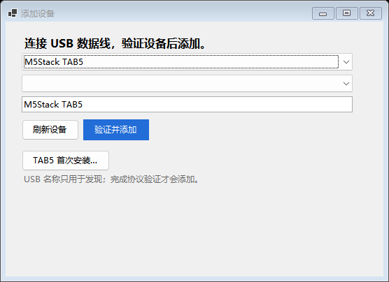
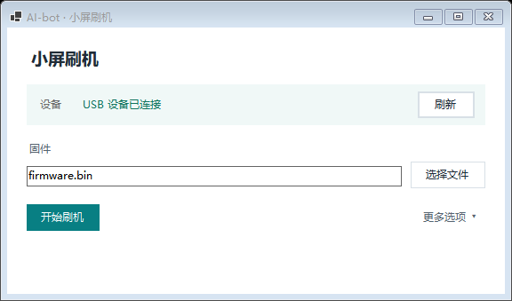
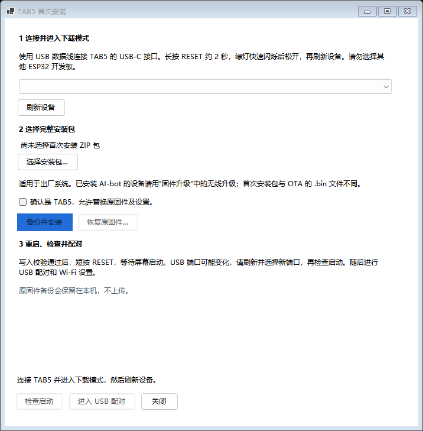
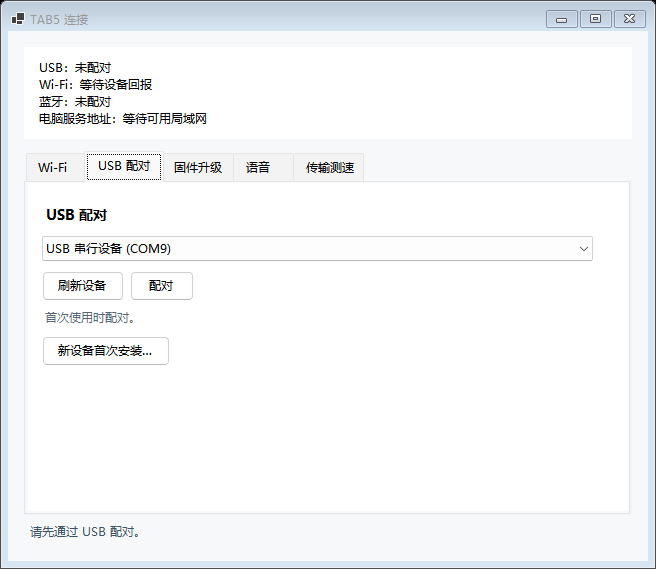
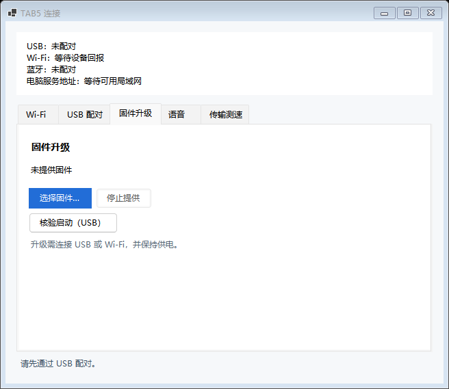
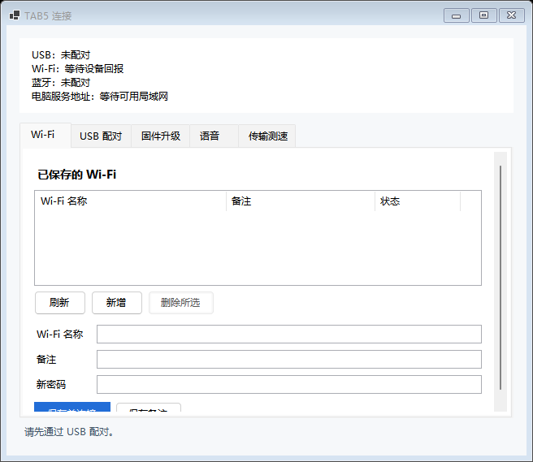

# AI-bot 安装与刷机指南

适用于 **AI-bot 0.6.1 / TAB5 0.2.149-ui / ESP8266 0.5.0**，更新于 2026-10-07。Windows 支持 ESP8266 与 TAB5；Mac 的刷机入口目前支持 ESP8266。

**先安装应用，再按你的设备选择下面一条路线。** 每条刷机路线只需 4 步。

## 1. 下载与安装

从 [AI-bot 0.6.1 发布页](https://github.com/yaoyouzhong/AI-bot/releases/tag/bridge-v0.6.1)开始；TAB5 固件在[配套 TAB5 发布页](https://github.com/yaoyouzhong/AI-bot/releases/tag/tab5-v0.2.149-ui)；可选图库继续使用[原图库包](https://github.com/yaoyouzhong/AI-bot/releases/tag/tab5-v0.2.145-ui)，已有图库无需重下。按用途选择：

| 你要做什么 | 下载什么 |
| --- | --- |
| Windows 安装应用 | [Windows 安装器](https://github.com/yaoyouzhong/AI-bot/releases/download/bridge-v0.6.1/AIBotBridge-0.6.1-setup-win-x64.exe) |
| Mac 安装应用（macOS 13+、M 系列芯片） | [Mac 应用 ZIP](https://github.com/yaoyouzhong/AI-bot/releases/download/bridge-v0.6.1/AIBotBridge-0.6.1-local-candidate-macos-arm64.zip) |
| ESP8266 首刷或更新 | [ESP8266 固件 ZIP](https://github.com/yaoyouzhong/AI-bot/releases/download/v0.5.0/AI-bot-0.5.0-firmware-materials.zip) |
| TAB5 从出厂系统首次安装 | [TAB5 首刷 ZIP](https://github.com/yaoyouzhong/AI-bot/releases/download/tab5-v0.2.149-ui/TAB5-first-install-0.2.149-ui.zip) |
| TAB5 已安装 AI-bot，更新固件 | [TAB5 升级 ZIP](https://github.com/yaoyouzhong/AI-bot/releases/download/tab5-v0.2.149-ui/TAB5-upgrade-0.2.149-ui.zip) |

**TAB5 首刷也是 0.2.149-ui，无需先刷旧版。** 首刷包直接选择 ZIP；升级包先解压，再选里面的 `aibot_tab5.bin`，同目录保留 `aibot_tab5.bin.notes.json`。两种硬件的固件不可互换；GitHub 的 Source code 不是刷机文件。

桥接、ESP8266 和 TAB5 分别更新，版本号可以不同；以后只升级更新说明要求的部分，无需每次一起刷机。

Windows 0.6.1 从“设备中心 → 桥接设置 → 软件固件”打开统一的[软件与固件更新](UPDATES.md)：自动提醒、显示明细、选择对应包、下载并校验，再进入现有安装流程。旧版用户先安装新的电脑端；首次安装方法不变。名画／书法是可选的[独立图库](GALLERY-PACKS.md)，不下载也可使用其他功能。

Windows：运行安装器，保持联网以便补齐缺少的运行环境；安装后在右下角托盘右键 → **设备中心**。已有用户先退出桥接，安装到原位置，再用原快捷方式启动。

新设备点 **我的设备 → 添加**，选择对应型号。已有 AI-bot 固件的设备可直接 **验证并添加**，无需首刷。当前支持每种型号一台。

截图来自当前原生 Windows 程序，使用隔离演示数据；端口号仅为示例，操作时选择自己的设备。

## 2. 按硬件刷机（选一条）

### A. ESP8266：首次安装或更新 · 4 步

准备 USB 数据线，设备须为支持的 ESP8266 / ESP-12S、240×240 ST7789 小屏；其他板卡先核对[引脚配置](../firmware/platformio.ini)。

1. **连接并打开刷机。** 插 USB；新设备在“添加”里选 **ESP8266 小屏 → ESP8266 首次安装…**，已有设备选中小屏 → **管理… → 固件升级**。关闭其他串口工具，保持 AI-bot 桥接运行。
2. **选择文件并刷入。** 点 **选择文件**，直接选下载的 ESP8266 固件 ZIP，无需解压；确认设备后点 **开始刷机**。工具自动先备份，再写入和回读校验；过程中保持供电与连接。

3. **看到完成后添加。** 提示“刷机完成”后关闭窗口；新设备回“添加”刷新，点 **验证并添加**；已有设备等待 USB 恢复。失败不要当作成功，按[排错](#troubleshooting)处理。
4. **检查屏幕并收尾。** 在设备中心打开 **显示设置**，确认实体屏能更新、切页；恢复自动显示与循环展示，保留原页面、顺序和间隔。

### B. TAB5：从出厂系统首次安装 · 4 步

使用 **USB-C 数据接口**连接电脑。首次安装会替换 P4 原固件与设置，工具先完整备份；保留备份以便恢复。已有 AI-bot 的设备使用下方升级路线。

1. **进入安装窗口与下载模式。** “添加”里选 **M5Stack TAB5 → TAB5 首次安装…**。连接 USB-C，长按 RESET 约 2 秒，内部绿灯快速闪烁后松开；点 **刷新设备**，选择这台 TAB5 的端口。[进入下载模式的官方说明](https://docs.m5stack.com/zh_CN/guide/tab5/restore_factory)。
2. **选择首刷 ZIP 并安装。** 点 **选择安装包…**，选 `TAB5-first-install-0.2.149-ui.zip`，勾选“确认是 TAB5，允许替换原固件及设置”，点 **备份并安装**。按提示确认设备；等待备份、写入、校验结束，不拔线。

3. **重启并检查。** 提示“写入校验通过”后短按 RESET，等待屏幕启动；点 **刷新设备**，重新选择启动后的端口，再点 **检查启动**。检查通过后点 **进入 USB 配对**返回上层。端口号变化属于正常情况。
4. **添加并确认数据。** 回“添加”刷新，选重启后的 TAB5，点 **验证并添加**，此操作会完成 USB 验证与配对。确认实体屏、触摸和数据更新；需要重新配对时使用 **连接升级 → USB 配对 → 刷新设备 → 配对**。恢复自动连接与自动展示，保留原显示设置。

### C. TAB5：已有 AI-bot，后续升级 · 4 步

1. **解压并打开升级页。** 完整解压 `TAB5-upgrade-0.2.149-ui.zip`。设备中心选中 TAB5 → **连接升级 → 固件升级**，保持有效连接和供电。
2. **提供固件。** 点 **选择固件…**，选解压后的 `aibot_tab5.bin`，同目录保留更新说明文件；核对版本 **0.2.149-ui** 与更新说明，确认提供。

3. **在 TAB5 上确认安装。** 按设备提示开始升级，等待传输、校验与重启。“已提供固件”只是准备完成，不代表已安装。
4. **核验并恢复显示。** 重启后用 USB 连接电脑，点 **核验启动（USB）**，看到“启动核验通过”后检查触摸与数据；恢复原连接模式、自动展示及轮播设置。

首刷 ZIP 不用于应用升级。旧分区不兼容时停止操作，按对应迁移方案处理，不用首刷来保留已有设置。

## 3. 可选设置

设备中心分三页：**我的设备、账号数据、桥接设置**。账号数据提供模型账号、天气定位、自选股票和额度历史；我的设备中选择一台设备，再配置显示、数据与连接；桥接设置提供开机启动、服务状态、软件固件、配置迁移和提醒管理。TAB5 另有语音、日历生日与常用任务。

ESP8266 的“显示设置”选择自动轮播、智能跟随或固定页；自动屏保等待时间在“连接设置”。TAB5 的屏保类型与预览在设备“设置 → 屏幕与声音”；名画／书法先按[图库说明](GALLERY-PACKS.md)导入。

TAB5 需要无线时，在 **连接升级 → Wi-Fi** 保存网络并确认有效数据。先把 USB 主流程完成，再按需设置无线；Wi-Fi 已关联不等于桥接数据已连通。ESP8266 无线设置见[进阶说明](FLASH_BUILD.zh.md)。

## Mac：应用安装与 ESP8266 刷机

解压 Mac 应用 ZIP，将 App 放入“应用程序”。应用临时签名且未公证，首次打开按 [Apple 标准方法](https://support.apple.com/zh-cn/102445)操作；Intel Mac 未验证。Windows 安装器也未签名。

连接 ESP8266，菜单 **AI-bot → 小屏刷机…**，选 ESP8266 固件 ZIP，按窗口提示完成备份、写入与回读校验，再检查真实屏幕和连接。本文 TAB5 首刷、配对和升级使用 Windows 工具；不把 Windows 截图当作 Mac 界面。

## 出错时怎么办

| 问题 | 处理 |
| --- | --- |
| 找不到设备 | 换 USB 数据线或接口；TAB5 首刷先进入下载模式，再刷新。ESP8266 确认缺驱动时安装 [WCH 官方驱动](https://www.wch.cn/downloads/CH341SER_EXE.html) |
| 文件选不了 | 核对路线：ESP8266 选自己的 ZIP；TAB5 首刷选首刷 ZIP；TAB5 升级选解压后的 BIN |
| 端口占用 | 关闭其他串口工具；使用内置刷机时保持桥接运行，由工具释放 USB |
| 备份、写入或校验失败 | 保留错误与备份，确认设备仍能启动，不强行跳过检查 |
| TAB5 重启后找不到 | 刷新并选择重启后的端口，再检查启动；不要重新首刷 |
| TAB5 首刷后需恢复原系统 | 重新进入下载模式，在首次安装窗口点 **恢复原固件…**，选同一台设备的 `.bin.json` 备份记录；校验通过后短按 RESET 检查原系统 |
| 已连接但无数据 | 确认设备已添加、USB 配对成功与桥接正在运行 |

备份保存在 `%LOCALAPPDATA%\AI-bot\device-backups\`，TAB5 的 `.bin` 和 `.bin.json` 一起保留；备份可能包含私人设置，不公开上传。USB 偶发中断仍有历史记录，失败先保留错误，不把重试成功理解为已修复。

需要核对下载完整性时，使用对应组件发布页的 SHA-256 清单：[电脑端](https://github.com/yaoyouzhong/AI-bot/releases/download/bridge-v0.6.1/SHA256SUMS.txt)、[TAB5](https://github.com/yaoyouzhong/AI-bot/releases/download/tab5-v0.2.149-ui/SHA256SUMS.txt)、[图库](https://github.com/yaoyouzhong/AI-bot/releases/download/tab5-v0.2.145-ui/SHA256SUMS.txt)、[ESP8266](https://github.com/yaoyouzhong/AI-bot/releases/download/v0.5.0/SHA256SUMS.txt)。[发布与验收记录](RELEASE-0.6.1.md) · [TAB5 开发者源码](development/TAB5-SOURCE.md) · [许可范围](TAB5-LICENSE-SCOPE.md)

## English summary

Current releases are computer apps 0.6.1, TAB5 0.2.149-ui and ESP8266 0.5.0. Install the app and choose one hardware route. Windows Device Center separates My Devices, Account Data and Bridge Settings; open Bridge Settings → Software/Firmware for later updates. Each Windows flashing route has four steps: connect/open, select the correct firmware, complete installation/restart, and verify/register. ESP8266 accepts its firmware ZIP directly. Factory TAB5 devices use the full first-install ZIP at 0.2.149-ui: enter download mode, back up/install, reset and check boot, then verify/add to pair. Existing AI-bot TAB5 devices extract the upgrade ZIP and select the application BIN with its notes file, confirm installation on TAB5, then verify boot over USB. Do not interchange hardware packages. Preserve automatic display/cycling and existing settings. Mac flashing currently covers ESP8266; Windows TAB5 support does not imply Mac TAB5 support. Images show native Windows controls with synthetic data, not hardware photographs. Original backups stay private. Own code is MIT licensed, with third-party terms preserved.
